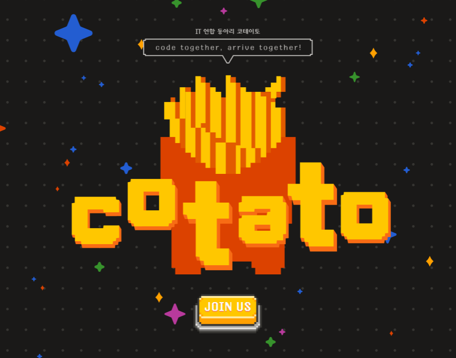
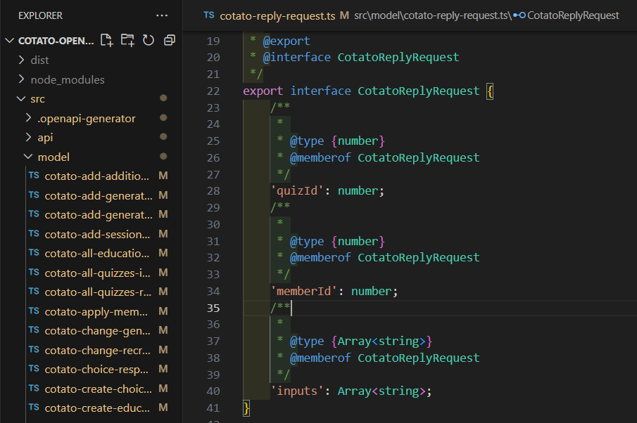
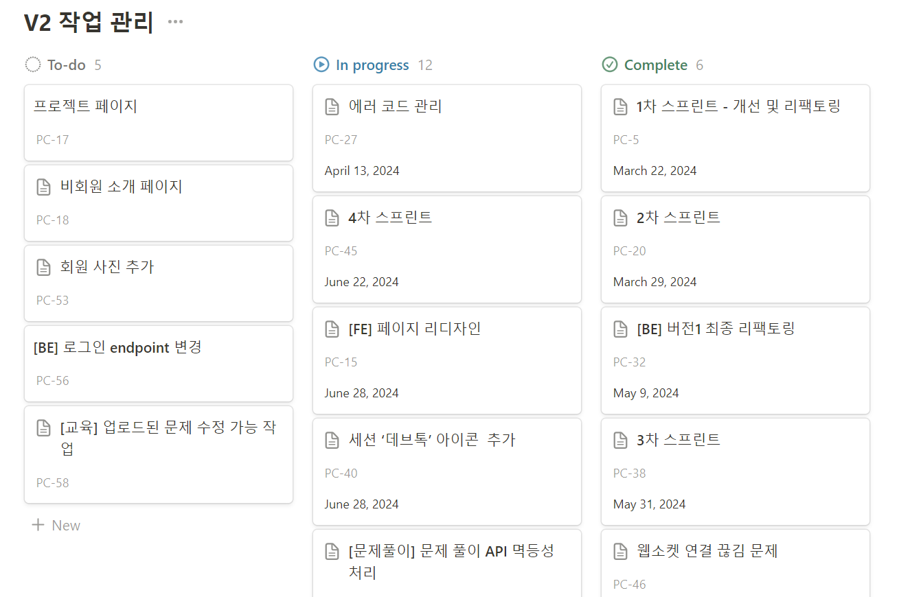
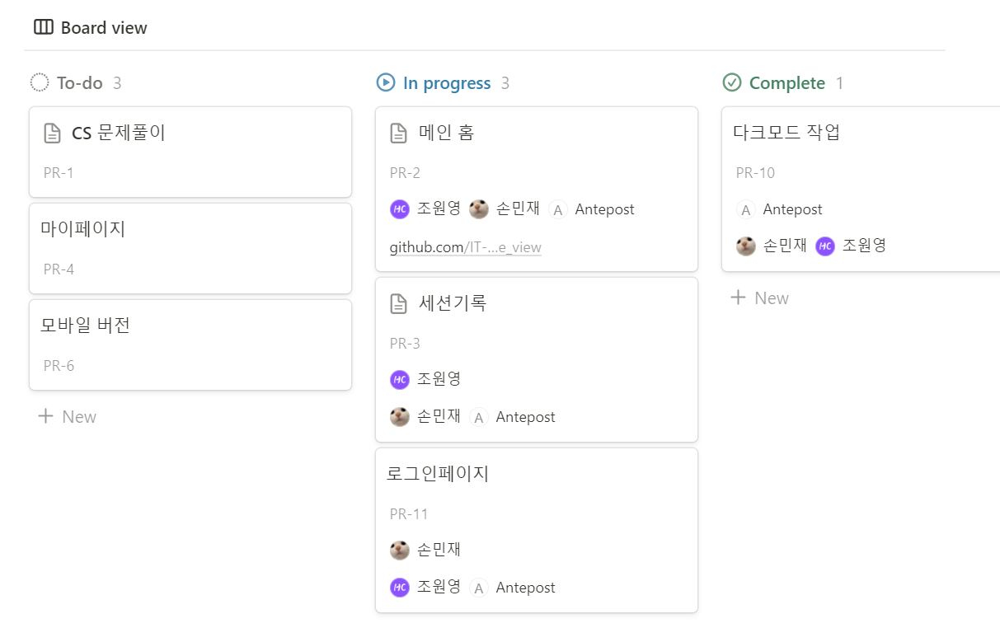
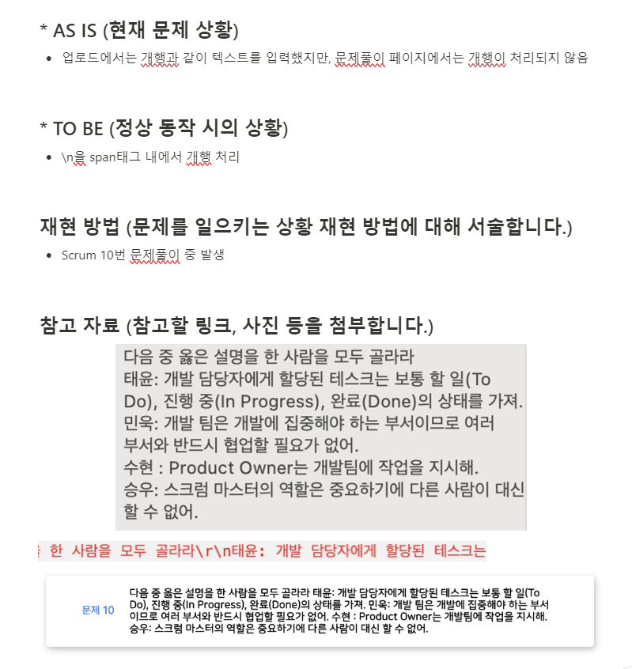

# 프로젝트 개요

활동 중인 IT 동아리 '코테이토'의 자체 웹 사이트로, 기존 프로젝트 주제는 CS 문제풀이 페이지 제작에 초점이 맞추어져 있었다. CS 퀴즈는 우리 동아리 정기 세션의 주요 콘텐츠인 CS 교육 직후에 항상 진행하곤 한다. 원래는 이걸 ppt와 카톡을 이용해서 진행했었는데 불편한 점들이 꽤 있었다. 그래서 이 불편함을 우리가 직접 해결해보자! 해서 운영진 다수와 일부 부원들이 모여 이 프로젝트를 진행하게 되었다. 8기부터 시작해서 지금까지 벌써 8개월도 넘게 진행하고 있는 만큼, 중간 회고 글을 한 번 써보려 한다.

<br/><br/>

# COTATO (ver.2)



## 프로젝트 목표

우선 해당 프로젝트는 앞에서 소개했던 CS 문제풀이 서비스로서의 목표는 올해 2월말 데모데이를 기점으로 달성 후 현재는 코테이토의 공식 홈페이지로서 거듭나기 위해 대확장 공사를(운영과 동시에) 진행 중이다.

우리의 궁극적인 목표는 **동아리의 간판**이 될 웹 사이트를, **IT 동아리**라는 이름을 걸고 직접 만드는 만큼 '**우리가 어떤 동아리인지 보여주고 사람들에게 알리는 것**'이다.

<br/>

## 새롭게 진행한 부분

서비스의 목적 자체가 달라지고, 동아리에 책임감과 애정이 강한 멤버들이 모인지라 우리 중 그 누구도 적당히 할 생각이 없었다.ㅋㅋ

우리 플젝팀 특 : `"최선을 다하지 않는 걸 못 참음"`

<div align="center">
  
  <small>ㅎㅎ</small>
</div>

<br/><br/>

우선은 말한 것처럼 우리의 얼굴이 될 페이지가 아닌가? 유감이지만 디자인이 이쁘지 않으면 아무리 기술적으로 안정적이고 기능적으로 뛰어나도 신뢰도도 급하락하고 관심도 없는게 현실이다. 따라서 **전체적인 페이지 리디자인** 작업이 진행되었다.

이 외에 크게 달라지는 부분은

- FAQ 페이지 추가
- 출석 기능 추가
- About Us, Project 페이지 공개
- 기존 UI 개선

이 정도가 되겠다. <br/>

<br/>

그리고 공식 캐릭터도 만들었다ㅎ

~막간 자랑 time~


~~맥반석 계란 아님~~
<small>디자인 천재 ㄴㅇㅈ님께 무한한 영광을</small><br/>

ㅎㅎ짱귀엽져?

<br/>

### 개발적인 부분

> ✅ 컨벤션 보완 및 준수 <br/>

기존에는 팀 컨벤션이 거의 있는 듯 없는 듯 했다. 우리 프론트 팀은 총 세 명이서 협업했기 때문에 각자의 작업 스타일이 조금씩 다를 수 밖에 없었고, 이를 맞춰주기 위해 사용한 도구는 실질적으론 ESLint와 Prettier 뿐이었다. 컨벤션이 중요하다는 것을 깨닫기 시작한건 프로젝트 규모가 커지면서부터이다. <br/>
pages 폴더 안의 CS 폴더만 해도 파일이 28개나 된다. 무서운 건 CS 폴더 외에 Home, Session, MyPage, Login 등등이 더 존재하고, pages 폴더와 같은 위치에 components 폴더도 따로 존재한다는 점이다. 이렇게 규모는 커져가는데 통일성과 유일성이 흐려지는 상황에서 우리는 다음과 같은 대책을 세웠다. <br/>

- 디렉토리 구조 정비 <br/>
  - 이미지 사용과 관련해서는 기존에는 어쩔 땐 이미지 주소를 불러오고 어쩔 땐 assets 폴더에 저장해서 import해 사용했었다. 공통 저장소가 있는 것이 아니다보니 url이 통일되지 않아서 일단은 후자의 방식으로 통일하기로 하였다. 어느 곳에 사용된 이미지인지를 쉽게 알게 하고 중복될 일을 최대한 방지하고자 prefix를 붙이기로 하였다. <br/>
    ex) `header_logo.svg`, `login_btn_hover.svg`
  - components 폴더 안에는 모든 컴포넌트가 구분 없이 저장되어 있었는데, 도메인에 따라 하위 폴더를 생성하기로 하였다. (단, 공통 컴포넌트에 한해서는 하위 폴더 없이 그대로 진행)<br/>
    ex) `/src/components/Home/HomeDropDownMenu.tsx`, `/src/components/Header.tsx`
- 컴포넌트 네이밍 컨벤션 정의 <br/>
  ex) `/src/pages/CS/admin/upload` -> `CSAdminUpload${yourComponentName}.tsx`
- 코드 순서 정의 <br/>
- props 순서 정의 <br/>
- 함수 정의 시 JSDocs 사용 필수화 <br/>
- 기타 컨벤션 <br/>
  - 사용하지 않는 코드 삭제 <br/>
    ex) `console.log()`, `unused variable`
  - 스타일 코드에서 너무 특정한 값 지양 <br/>
    ex) `line-height: 13.765px;` -> `line-height: 14px;`
  - 자식이 없는 태그는 단일 태그로 사용 <br/>
    ex) `</img>` -> ``
  - 핸들러 함수는 접두사 `handle`로 네이밍 <br/>
    ex) `clickModalOpen` -> `handleModalOpen`

<br/>

> ✅ Git Flow 적용 <br/>

서비스를 운영하면서 페이지들을 순차적으로 새로운 디자인으로 바꾸고, 매주 세션마다 생기는 이슈들에 대해 수정사항을 업데이트해야 하기 때문에 효율적인 버전 관리가 필요하다고 생각했다. 특히, 테스트 서버를 새로 만들기도 했고 이후에 계획 중이었던 프론트 CI/CD 구축도 고려하면 브랜치 전략을 세우는 것이 좋겠다고 판단하였다. <br/>

크게 develop, release, main 브랜치 세 개를 두었고 각각의 역할은 다음과 같다. <br>

- `develop` : 기능 개발에 사용되는 브랜치. 각 이슈에 대해 보조 브랜치(`feature`)를 파서 작업한다.
- `release` : = QA 브랜치. 테스트 서버와 연결하여 다음 출시 전 점검하고, 문제가 없으면 main에 병합한다.
- `main` : 프로덕트 브랜치. 실제 서비스가 배포되는 브랜치이다. 긴급 수정사항에 대해서는 여기서 보조 브랜치(`hotfix`)를 생성하여 반영한다.

<br/>

간단하게 설명하자면 이 정도고, 자세한 내용은 <br/>
[Git Flow : 효율적인 버전 관리를 위한 브랜치 전략](https://pingzeming.tistory.com/65) <br/>
여기에 자세히 적어놨으니 참고하길 바란다 ㅎ

<br/>

> ✅ CI/CD 구축 및 릴리즈 노트 작성 <br/>

V2로 넘어오면서 지속적인 개발과 배포가 이루어지기 때문에 프론트 쪽도 빠른 배포 주기를 위해 지속적 통합 및 배포를 위한 파이프라인을 구축해야겠다 마음 먹었었다. main 업데이트 시마다 서버에서 프론트 코드를 받아서 배포하는 것도 번거로웠고, 배포 전 빌드 테스트가 자동으로 이루어지지 않는 것도 상당히 신경쓰이는 점이었다.

우리는 Github Action으로 CI/CD 파이프라인을 구축하였고, 다음과 같이 설정하였다. <br/>

- `develop` : lint job -> build job
- `release` : lint job -> build job -> release job (auto, QA)
- `main` : lint job -> build job -> release job (manual)

<br/>

> ✅ ThemeProvider를 통한 공통 스타일 속성 관리 <br/>

자주 쓰이는 color, font-size, size의 속성값을 theme.ts에 정의해놓고 ThemeProvider의 props로 theme을 전역적으로 전달해준다. 이 방식을 통해 우리는 다음과 같이 변수화된 속성을 편리하게 가져다 쓸 수 있게 되었다.

```css
color: ${({ theme }) => theme.colors.gray80};
```

이때 각 색상 변수마다 라이트모드/다크모드에서의 대응되는 색상을 두 가지 theme 객체에 저장하여, 다크모드 전환 시에 활용할 수 있도록 하였다.

<br/>

비슷하게 반응형 작업 시 편의를 위해 디바이스 화면 크기도 변수화해 정의해놓고 다음과 같이 사용하고 있다.

```css
${media.mobile`
   width: 500px;
   background-size: 500px 100px;
   color: ${({ theme }: { theme: CotatoThemeType }) => theme.colors.secondary5};
`}
```

<br/>

> ✅ OpenAPI를 통한 타입관리 <br/>

코드 안정성을 높이기 위해 response, request 데이터의 타입을 따로 정의하여 관리하고자 하였다. 이때는 백엔드 팀에서 노션에 작성해둔 API 명세서를 보면서 직접 만들었었다. 하지만 API 명세가 간간이 수정되기도 하고, 또 수정사항을 바로바로 반영하지 못했을 경우 말로 전달했다고 해도 프론트측에서 명세서와의 오차로 인해 헷갈리다보니 서로에게 혼란이 생기곤 했다.

그래서 최근 백엔드 측에서 Swagger로 API 문서를 자동화하였다. 이에 맞춰 프론트도 OpenAPI 스펙을 사용하여 서버 api에 대응하는 데이터 타입을 자동으로 생성시키는 방식을 사용하기 시작하였다. <br/>

npm에 `cotato-openapi-clients`라는 이름으로 배포하여 라이브러리처럼 import해와서 타입을 사용할 수 있도록 하였고, 전체 코드는 COTATO-FE 레포지토리와 별도로 다른 전용 레포를 파서 관리 중이다. 이로써 서버에서 업데이트가 이뤄지면 `yarn open-api` 명렁어 하나만 입력해도 자동으로 바뀐 데이터 타입을 사용할 수 있게 되었다.

<br/>

### 개발 외적인 부분

> ✅ 팀 의사소통 활성화 <br/>

솔직하게 V1에서는 못난 팀장(= 나..)이 팀장의 역할을 야무지게 수행하지 못했었다. 열심히 하기 싫었던 건 아니고, 정확히는 뭘 어떻게 해야 할지 몰랐다. 이전까지의 프로젝트에서는 경험이 적었던 탓에 항상 팔로워를 자처하기도 했고... 어쩌다보니 프론트 팀장을 맡게 되었지만 내가 가장 잘나서가 아니었기 때문에... (오히려 그 반대에 가깝다) 특히 데모데이 직전 스프린트 때에는 할게 너무 많은데 작업 상황을 임시로 노션에 적어놓으며 공유한 것을 보고 프론트 팀원 간 소통이 많이 부족했음을 느꼈다. 부족한 사람이 괜히 프론트장을 맡는 바람에 벌어진 일이라고 생각했지만, 사실 실력적인 면은 여기서 중요한게 아님을 깨닫고 반성했다.

V2에 와서는 가장 우선적으로 프론트 팀 내 정기 회의 일자를 잡았다. 주기는 일주일에 한 번, 전체회의가 있는 주말 직후인 월요일로 잡았다. 내용은 이번주 진행 상황, 다음 회의까지 목표를 필수로 잡았으며, 전체 회의 때 나눴던 내용 혹은 추가로 의논하고 싶은 내용을 매주 정리하여 회의를 주도했다. <br/>
확실히 꾸준히 소통하는 장을 열고 나니 답답했던 부분들은 자연스럽게 원활히 진행되기 시작했다. 서로 코드도 읽어보고, 이런거 저런거 같이 고민해보고 새로운 것도 시도해보며 계속해서 성장 중인 지금 또한 '활발한 의사소통'이 이뤄낸 결과이지 않을까 싶다.

<br/>

> ✅ 작업 일정 체계화 <br/>

우리 프로젝트는 기획자 1, 백엔드 3, 프론트엔드 3, 디자이너 2 로 구성된 대학생 동아리 단위의 플젝 치고 인원도 상당히 많고 작업의 규모도 제법 되기 때문에, V2에 진입하자마자 거의 작업 일정을 체계화시켰던 것 같다.

기업에서는 Jira를 활용해 작업을 관리하고 많이들 협업하는 것으로 알고 있다. 하지만 사용법이 그리 간단하지는 않은 것으로 알아 플젝 인원 전체가 사용법을 익혀야 하고, 여유가 넘치지 않는 상황에서 새로운 것을 들이는 것에 대해 비용이 큰 것 같다고 생각했다. 결론적으로는 Notion을 사용하여 Jira와 유사하게 템플릿을 생성하여 다음과 같이 일정 탭을 만들었다.

 <br/>
해당 페이지가 대분류 보드이고, 아래 페이지는 대분류에서 하나를 선택했을 때의 중분류 보드이다. (소분류 보드는 depth가 깊은 경우에 한해서만 존재) 각각의 task 생성 시 고유한 ID값을 함께 생성하도록 하여 `develop` 브랜치에서 `feature` 브랜치를 파서 작업한다.
 <br/>
사진과 같이 대분류에 **[FE] 메인 페이지 리디자인** 보드가 있고, 그 안에 **로그인 페이지**가 중분류 task로 있는 경우 : <br/>
`develop` -> `sprint/PC-15_page_redesign` -> `feat/PR-11_implement_login_page` <br/>
이와 같은 플로우로 브랜치를 생성하여 작업하면 된다.

<br/>

추가로, 문제가 발견되면 아래와 같이 문제 상황, 기대하는 상황, 재현 방법, 참고 자료를 포함하여 **이슈 리포트**에 올려놓도록 하였다. 이 부분에 올라오는 task들은 hotfix로 처리하여 관리한다. <br/>


<br/>

> ✅ 코드리뷰 문화 도입 <br/>

프론트 팀 내에서는 Git Flow 적용과 동시에 코드리뷰 문화를 도입하였다. 사실 우리끼리 코드리뷰 해봤자 뭐 되려나 싶어서 큰 기대는 하지 못했다. 그나마 우리 팀엔 코테이토 공식 프론트의 신(a.k.a. 프신)이라고 불리우는 그가 있었기에 ... 작지만 큰 도움을 받았을 수 있었다. 초반엔 몇 번 리뷰(라고 하고 지적이라고 쓴다)를 받다 보면 내 PR이 머지됐을 때 은근 기쁜 것이, 생각보다 쉽지 않음을 느꼈다. 코멘트 반영하고 계속 리뷰받는게 생각보다 귀찮다.. 물론 남의 코드를 그만큼 꼼꼼하게 읽고 리뷰해주는 입장이 더 귀찮을 걸 알기에 속으론 아주 감사하고 있다.ㅎ 나중에는 한 소리 듣기 싫어서라도 최대한 깔끔한 코드를 짜려고 노력하게 된다. 그래봤자 아직 내공이 적은 나에게는 쉽지 않지만ㅠ

내가 남의 코드를 리뷰할 때에도 사실 마찬가지이다. 누군가 PR을 올리면 성실히 읽어보기는 하나... 뭘 더 개선하면 좋을지를 생각해내기는 커녕 코드를 완전히 이해하는 것조차 쉽지 않은 것이 지금 현실이다. 그래서 스승님이 리뷰를 다시면 그때서야 보고 배운다. 조금씩이지만 리뷰든 남의 코드든 많이 보면 볼 수록 뭐가 더 좋을지 느껴지고 점점 내 코드 짤 때도 적용해보게 되긴 하더라. 나중에 회사에 가서 일하게 될 때는 내가 짠 코드보다 남이 짠 코드를 건들일 일이 훨씬 많을 텐데, 지금부터 연습하는건 이런 의미에서 꽤나 도움이 될 것이라 생각한다.

아, 추가로 '남이 짠 코드를 건들일 일'에서 그 '남'에는 '과거의 나'도 포함된다는 걸 깨달았다 ...ㅎㅎㅎㅎ V2 와서 V1의 내가 짠 코드를 보면 정말 답이 없더라 ㄷㄷ 어떻게 구현만 겨우 해내서 자잘한 기능 추가나 수정 하나만 하려 해도 쉽지 않은 걸 보고선 '클린코드'라는게 왜 중요한지 뼈저리게 느꼈다^^

<br/><br/>

# 배우고 느낀 점

확실히 코테이토 프로젝트는 처음에 1차로 기획했던 것을 개발하고 끝! 혹은 운영해봤으니까 끝! -> 이게 아니라 계속해서 운영을 유지하며 디벨롭해나가고 있기에, 그 과정에서 정말 많은 걸 배우고 느끼게 되는 것 같다.

바로 위에서 한 얘기를 포함해서, V1에서 구현에 집중했던 것과 달리 지금은 새로운 것들을 많이 도전해보는 중이고, `개발 = 기능을 구현해내는 것` 이런 단순한 개념이라고 아주아주 크게 착각했던 지난 날의 나와 비교해보면 그래도 제법 성장하지 않았나 싶다. 요새 들어 리팩토링을 조금씩 시도할 때마다 과거의 나를 조금 패고 싶지만 그때는 웹소켓을 사용해서 문제풀이 로직을 구현한 것도 꽤 큰 도전이었으니 이해해주기로 했다.


<br/>

## 아쉬운 점

> 😓 문서화 <br/>

- 새롭게 도입한 기술에 대해, 한 명이 적용하고 나면 사실 다른 팀원들은 사용법을 정확히는 모를 수 밖에 없다. 프론트 회의 때 공유하고 어느정도 기록은 하지만 추후에 사용해볼 때를 생각해서 좀 더 잘 정리된 문서를 남기면 좋을 것 같다.
- 이것도 사실 같은 흐름인데 트러블 슈팅이나 개발하면서 마주한 이슈나 해결방안을 발자취처럼 기록한다면 좋지 않을까 싶다. 개블스를 성실히 하며 느낀 거지만, 공부한 것은 '그렇구나'에서 그치는 것이 아니라 "남에게 설명한다고 생각하고 나의 언어로, 글로 정리할 때" 비로소 내 머릿 속에 입력된다고 생각한다.
- 작업 보드나 이슈 리포트도 컨벤션을 세워서 정확히 지키도록 하면 좋을 것 같다는 생각이다. 최근엔 어느 곳에 어떤 task를 올려놓을지도 기준이 명확하지 않아 같은 분류의 작업들이 각기 다른 곳에 제멋대로 올려있기도 하고, 열심히 쓰는 사람만 작업 상황을 반영하는 것 같은 느낌이 들어서 이 또한 조만간 개선할 점이라고 생각한다.

  <br/>

> 😓 사용자 모니터링 <br/>

- 문제풀이 쪽에서 지속적으로 문제가 발견되고 있는데, 백엔드 쪽에서 노력을 많이 하고 있지만 프론트측에서도 사용자 오류 모니터링을 진행해보려고 계획 중이다. Sentry라는 라이브러리를 사용할 예정인데, 이에 관해서도 추후 정리해보겠다.

<br/>

## 앞으로의 방향성

마지막 문단에서야 언급하는 거지만 사실 우리 프로젝트의 최대 강점은 '**팀워크**'이다. 거의 10명의 인원이 참여하고 있지만 큰 갈등 없이 지내면서도 객관적으로 정말 '잘' 돌아가고 있는 편이라 생각한다. 솔직하게 1명이 1의 효과를 낸다고 했을 때, 우리 9명이 모인 효과는 9보다 훨씬 크다고 생각한다. 팀원 하나하나가 이 프로젝트에 진심이고, 각자의 역할을 잘 해주고 있다. 그럼에도 사실 이 정도 인원이 잘 관리되기는 쉽지 않은데, 그게 가능한데에는 우리 팀 구조가 '수평적'이면서 '수직적'이라는 모순을 이상적으로 이루고 있기 때문인 것 같다. <br/>
이게 뭔 말인가 싶을 수도 있는데, 대충 그림으로 그려보면 <br/>
 <br/>
진짜 정확히 이런 느낌이다 ...ㅋ

그래서 결론은 앞으로도 쭉 이렇게 해나갔으면 좋겠다! 8월 데모데이까지 시간이 많이 남지 않았는데, 다들 조금만 더 힘냈으면 한다 :)
<div align="center">
  
</div>
