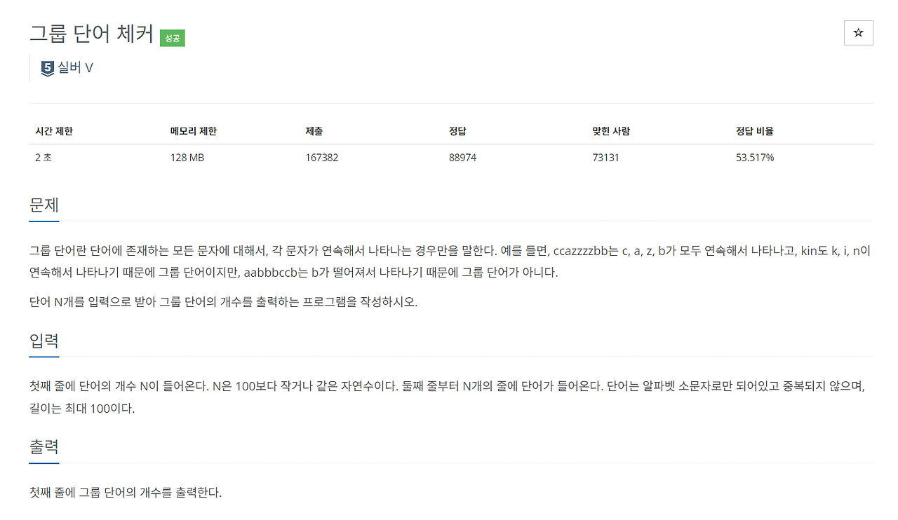
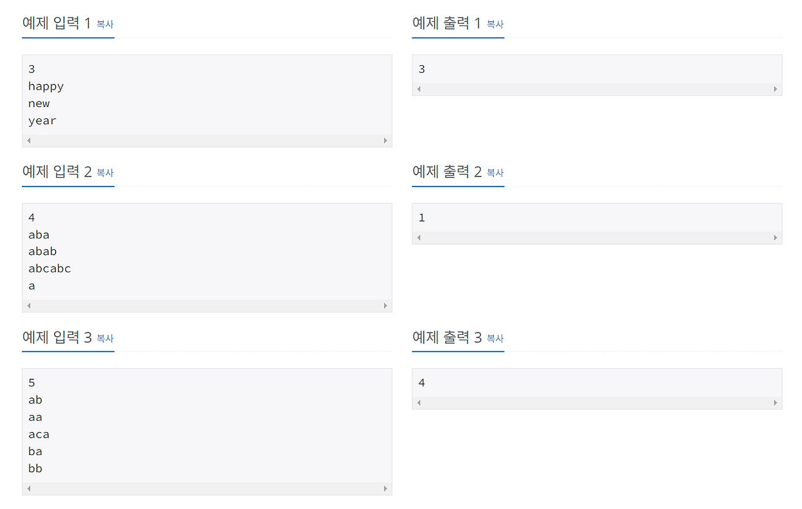
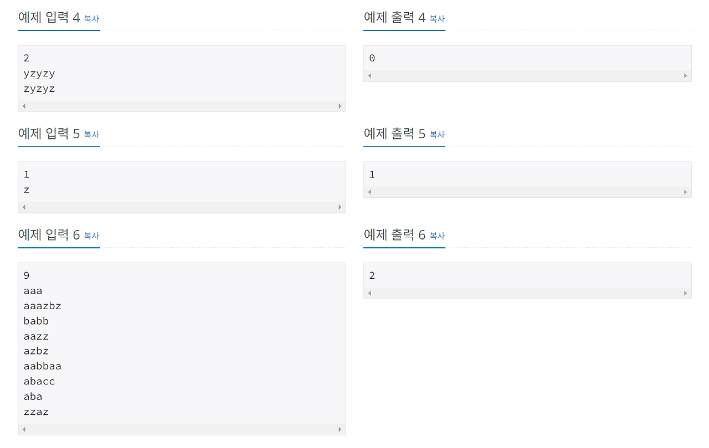

# [백준/JS] #1316 : 그룹 단어 체커 - 구현

뜬금 선언 먼저 하고 시작할게여ㅛ <br/>
저 코테 언어 JS로 바꿈

아니 사실 오늘 아침에 코테를 봤는데 언어가 자스로 제한된거임 !!.. 나 알고리즘에선 초면이란 말이얘,, <br/>
그래서 하루동안 벼락치기 하고 <br/>
결과는 시원하게 조짐

<br/>

그래서 바꿔요

<br/>

는 아니고 요새 확실히 파트별로 프론트면 JavaScript, 백엔드면 JAVA 이런식으로 언어 제한 두는 기업들이 늘어나고 있는데 <br/>
겸사겸사 자스 공부도 제대로 해보고 싶기도 했고, 아무래도 주로 다루는 언어로 알고리즘까지 하면 그 언어에 대해서 아는 깊이감도 생기게 되니 <br/>
분명 개발할 때도 도움이 될 것 같다 판단하여 바꿉니다

<br/>

...한두달 전인가에 이미 한 번 고민했다가 그냥 파이썬 하자~ 했었던 나

ㅎㅎ

<br/><br/>

사족이 길었네요 예

바로 스따뚜

---

## 문제

https://www.acmicpc.net/problem/1316 <br/>


 <br/>

### 💡 접근 핵심

'그룹 단어인지 체크'하고, 이를 카운트하면 된다.

그룹 단어인지 아닌지는 한 단어를 이루는 알파벳들 중 이미 한 번 나온적 있는 알파벳이 또 등장하게 될 때, 이 타이밍을 보면 된다.

- 하나의 단어(문자열)에 대해 첫번째 알파벳부터 순회하며 배열에 담는다.
- 이때, 배열 안에 이미 있는 문자라면 담지 않고, 바로 앞에 위치한 문자와 같은지를 비교한다.
  - 다르다면 이전에 나온 적 있는 문자가 연속되지 않게 재등장한 것이 되므로 그룹 단어가 아니다. 따라서 바로 false를 리턴하고 종료한다.
  - 같다면 같은 문자가 연속으로 나온 것이므로 계속 진행한다.

<br/>

## 정답 코드

백준은 입력으로 fs 모듈을 사용하는걸 공식적으로 권장하는 것 같던데, 그래서인가 readline 쓴 풀이는 보질 못했다. 나는 readline을 사용해서 풀어보았다.
<small>(반항심같은거 아니고 홍대병 아니고요 당장 시험봐야 했던 그 플랫폼이 fs 모듈이 사용이 안되는 것 같더라고요허허..)</small>

```javascript
const readline = require("readline");

const rl = readline.createInterface({
  input: process.stdin,
  output: process.stdout,
});

let input = [];
let count = 0;
let result = 0;

rl.on("line", function (line) {
  if (count === 0) {
    n = Number(line);
  } else {
    input = [line];
    if (isGroupWord(input[0])) {
      console.log(isGroupWord(input[0]));
      result++;
    }
    if (count >= n) rl.close();
  }
  count++;
}).on("close", function () {
  console.log(result);
  process.exit();
});

function isGroupWord(word) {
  let alphabet = [];
  for (let i = 0; i < word.length; i++) {
    if (!alphabet.includes(word[i])) {
      alphabet.push(word[i]);
    } else if (word[i] !== word[i - 1]) {
      return false;
      break;
    }
  }
  return true;
}
```

<br/><br/><br/>

---

첫 자스 후기 :

입출력이 ㄱㅟ찮단 소문이 사실이었슴

+) 코테 언어를 자스로 바꾼다는게 사실 좀 쫄렸어서 많이 망설였는데 하루 벼락치기 해 본 결과 좀만 더 해봐도 의외로 금방 익숙해질 것 같다는 생각? 그냥 꾸준히 연습이나 열심히 하자 <br>
문법도 공부할 예정 ! > 이거는 개발을 더 잘하기 위한 용으로 ...

<br>

코테에서 더 이상 발목 잡히지 않도록 지금부터라도 열 심 히 해보잣

<div align='center'>

</div>
