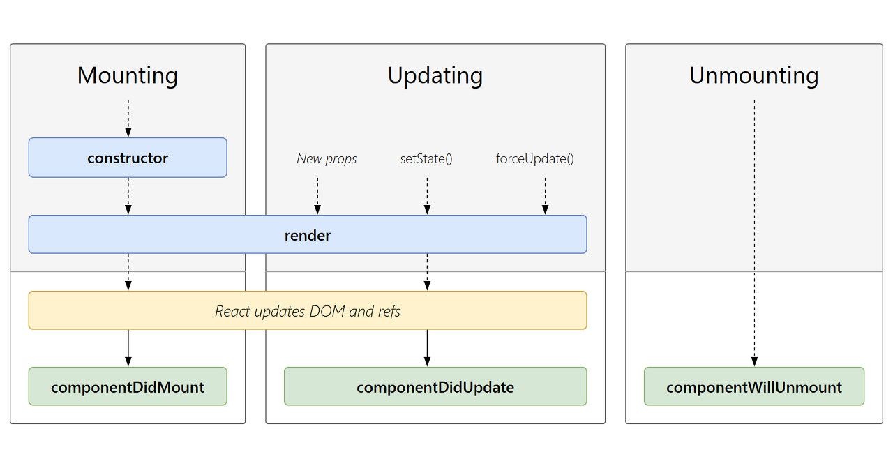
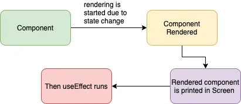
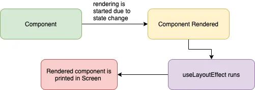

지난 주 웹소켓 관련 이슈를 해결하면서 리액트의 생명주기에 대한 이해가 아직 부족하다는 생각이 들었다. 거기다 문제 해결의 열쇠가 useEffect 쪽에 있었는데, 어쩌다보니 해결된 느낌이었어서 이에 대해서도 좀 더 제대로 공부해볼 필요성을 느꼈다. <br/>따라서 이번 주제는 React LifeCycle과 useEffect Hook이다. 두 가지는 연관성도 깊고 매우 중요한 개념인만큼 포스팅 길이가 다소 길어질 예정이지만, 공식문서를 특히 많이 참고하여 작성하였으니 가능한 한 정독^^해볼 것을 추천한다.

<div align='center'>
.&nbsp;&nbsp;&nbsp;&nbsp; .&nbsp;&nbsp;&nbsp;&nbsp; .
</div>
<br/>
<br/>
<br/>

# React Lifecycle

리액트에는 생명주기라는 것이 있다. 라이프사이클이라고도 하는데, 이는 리액트의 컴포넌트가 생성되고 소멸되기까지의 기간을 의미한다.

크게 마운트, 업데이트, 언마운트로 과정을 나눈다. 그리고 모든 컴포넌트는 생명주기의 특정 시점에서 자동으로 호출되는 메소드를 가진다. 이러한 메소드들을 생명주기 메소드라고 하며, 리액트의 클래스 컴포넌트에서는 생명주기 메소드를 사용하여 컴포넌트가 마운트 또는 언마운트 될 때 동작을 제어하고 원하는 작업을 수행하도록 할 수 있다.

<br/>



처음부터 파고들면 이해가 힘들테니 표와 함께 전체적인 플로우를 요약해보겠다.

<br/>

<strong>ㅡMountㅡ</strong> <br/>
`constructor` : 컴포넌트의 생성자 함수, state를 초기화 <br/>
`render()` : React가 화면에 보여줘야 할 내용을 알게 해줌 <br/>
DOM을 업데이트 <br/>
`componentDidMount()` : 컴포넌트 출력물이 DOM에 렌더링 된 후에 실행됨 <br/>
<strong>ㅡUpdatingㅡ</strong> <br/>
`setState()` : state의 변화를 React가 감지함 <br/>
`render()` : 화면에 보여줘야 할 내용을 알아내기 위해 다시 호출 (업데이트된 내용을 보여줌) <br/>
<strong>ㅡUnmountingㅡ</strong> <br/>
`componentWillUnmount()` : 컴포넌트가 DOM에서 삭제될 때 호출 <br/>

<br/>

- 참고용 코드

```javascript
class Clock extends React.Component {
  constructor(props) {
    super(props);
    this.state = { date: new Date() };
  }

  componentDidMount() {
    this.timerID = setInterval(() => this.tick(), 1000);
  }

  componentWillUnmount() {
    clearInterval(this.timerID);
  }

  tick() {
    this.setState({
      date: new Date(),
    });
  }

  render() {
    return (
      <div>
        <h1>Hello, world!</h1>
        <h2>It is {this.state.date.toLocaleTimeString()}.</h2>
      </div>
    );
  }
}

const root = ReactDOM.createRoot(document.getElementById("root"));
root.render(<Clock />);
```

각 단계에서 대표적인 생명주기 메소드는 `componentDidMount`, `componentDidUpdate`, `componentWillUnmount`이고, 마운트와 언마운트는 한 번 발생하는 것에 비해 업데이트는 여러 번 발생할 수 있다는 것이 특징이다.

<br/>

대충 어떤 느낌으로 동작하는지 감이 잡히시나요?😉

그렇다면 이제 각 단계에 대해 조금 더 자세히 알아보자

<br/>

## 마운트(Mounting)

컴포넌트가 생성될 때 발생하는 이벤트로, 생명주기에서 딱 한 번 실행된다. 쉽게 설명하자면 그냥 컴포넌트가 처음 실행되는 단계를 마운트라고 표현한다고 알면 된다.

마운트 시 호출되는 메소드의 종류와 순서는 다음과 같다.

<br/>

> 1️⃣ `constructor` : state, context, defaultProps 저장 <br/>
> 2️⃣ `getDerivedStateFromProps()` : props가 변경될 때마다 호출되며, 새로운 state를 반환할 수 있음 <br/>
> -> 정적 메소드로, 앞에 static 키워드를 붙여 사용함 <br/>
> -> 업데이트 시에도 호출되는 메소드이며, 마운트 시에는 초기 props를 통해 state를 초기화해주는 역할을 함 <br/>
> 3️⃣ `render()` : DOM에 컴포넌트를 부착하여 렌더링할 내용을 결정 <br/>
> -> 쉽게는 그냥 컴포넌트의 요소를 렌더링하는 메소드라고 알면 됨 <br/>
> 4️⃣ `componentDidMount()` : DOM에 삽입되어 렌더링 된 후 실행 <br/>
> -> DOM에 접근이 가능해짐 <br/>
> -> 주로 이 단계에서 AJAX 요청 또는 setTimeout, setInterval 등을 행동함 <br/>

<br/>

참고로, DOM에 컴포넌트를 삽입하기 전에 호출되던 `componentWillMount()`는 17버전부터 deprecated 되었다.

<br/>

## 업데이트(Updating)

컴포넌트의 props나 state가 변경되어 업데이트가 이루어질 때 발생하는 이벤트이다. 따라서 여러 번 실행되어 최신의 상태를 사용자에게 제공할 수 있도록 해준다.

업데이트 과정에서 호출되는 메소드의 종류와 순서를 살펴보자. <br/> 참고로, `componentWillReceiveProps()` 메소드의 호출 유무로 인해 props가 업데이트 될 때와 state가 업데이트 될 때의 과정이 살짝 달랐는데, 17버전부터는 deprecate되어 일치한다.

<br/>

> 1️⃣ `getDerivedStateFromProps()` : 변경된 props로 state를 업데이트할 수 있게 함 <br/>
> 2️⃣ `shouldComponentUpdate()` : 바뀔 다음 props 또는 state를 매개변수로 받으며, return 시 false를 반환하여 렌더링을 취소할 수 있음 <br/>
> -> 불필요한 렌더링을 막음으로써 성능 최적화 <br/>
> 3️⃣ `render()` : 컴포넌트 업데이트 <br/>
> -> 리렌더링 발생 <br/>
> 4️⃣ `getSnapshotBeforeUpdate()` : 가장 최근에 업데이트 된 출력이 DOM에 커밋되기 전에 호출됨 <br/>
> -> 업데이트로 인해 변경될 정보를 캡처해놓음 <br/>
> 5️⃣ `componentDidUpdate()` : 이전 props와 state를 매개변수로 받으며, 업데이트가 완료된 후 호출되므로 DOM에 접근이 가능해짐 <br/>

<br/>

참고로, `componentWillReceiveProps`와 `componentWillUpdate`는 17버전부터 deprecated 되었다.

- `componentWillReceiveProps` : 업데이트가 되기 전에 바뀐 부분이 있음을 감지하고 호출됨. 바뀔 props에 대한 정보를 가짐 (state update에서는 호출되지 않는 점 유의)
- `componentWillUpdate()` : 컴포넌트가 갱신되기 직전에 호출

<br/>

## 언마운트(Unmounting)

React element가 DOM에서 제거될 때, 즉 컴포넌트가 사라질 때 발생하는 이벤트이며, 한 번만 실행된다. 생명주기를 다하고 DOM에서 제거될 준비를 하는 단계이기 때문에 이 단계에서 리소스의 효율성 및 메모리 누수 방지를 위해 정리를 해주어야 한다.

> 1️⃣ `componentWillUnmount` : 연결했던 이벤트 리스너를 제거하는 등의 정리 활동을 함 <br/>
> -> `setTimeout()`을 사용한 부분이 있다면 여기서 `clearTimeout()`을 통해 정리해줌 <br/>
> -> 사용한 라이브러리의 dispose 기능이 있다면 이 또한 여기서 처리해주면 된다
> (ex. WebSocket의 close 이벤트)

<br/>
<br/>
<br/>

# React의 Function 생명주기와 React Hook

리액트 버전 16.8부터 훅의 등장으로 기존 Class 기반의 코드를 작성할 필요 없이 state와 여러 React의 기능을 사용할 수 있게 되었다. (리액트의 클래스형 컴포넌트에서는 상태값과 생명주기 기능을 사용할 수 있고, 함수형 컴포넌트에서는 이들을 사용할 수 없지만 대신에 훅을 사용할 수 있다는 것이 이 의미이다.) <br/>

이렇게 Hook이 등장하고 클래스형에서 함수형으로 리액트 생태계의 패러다임은 크게 바뀌었다. 생명주기 이벤트를 관리하고 side effect를 처리하던 방식 또한 클래스 컴포넌트에서 생명주기 메소드를 통해 이루어지던 기존의 방식에서 Effect Hook을 사용하는 것으로 변화하였다. <br/>

그럼 이제 함수형 컴포넌트에서 side effect를 수행할 수 있도록 하는 useEffect에 대해 알아봐보자.

> ✅ 데이터 패칭하기, 구독 설정하기, DOM에 접근하여 수정하기 등을 모두 side effect라고 한다.

<br/>

## useEffect

useEffect는 렌더링 이후(DOM 업데이트가 완료된 후)에 수행해야 할 일을 말한다.

위에서 리액트의 class 생명주기 메소드에 대해서 알아보았는데, useEffect Hook은 `componentDidMount`와 `componentDidUpdate`, `componentWillUnmount`가 합쳐진 것으로 생각할 수 있을 것 같다.

리액트 컴포넌트는 일반적으로 두 종류로 side effect를 분류하는데, 정리(clean-up)가 필요한 것과 그렇지 않은 것으로 나눈다.

<br/>

### clean-up을 이용하지 않는 Effects

- 네트워크 요청
- 수동으로 DOM을 조작하는 일
- 로깅(logging)

이러한 경우들은 리액트가 DOM을 업데이트 한 이후 추가로 코드를 실행시켜주어야 하지만 실행 이후 정리가 필요하지 않은 경우들이다.

이러한 side effect에 대해 class에서 구현할 때와 effect hook을 사용하여 구현할 때를 비교해보자.

<br/>

```javascript
  componentDidMount() {
    document.title = `You clicked ${this.state.count} times`;
  }
  componentDidUpdate() {
    document.title = `You clicked ${this.state.count} times`;
  }
```

class에서는 side effect를 `componentDidMount`와 `componentDidUpdate`에 담는데, 마운트 단계인지 업데이트 단계인지와 상관없이 렌더링 이후에 같은 effect가 발생되는 것을 기대하기 때문에 이 두 개의 생명주기 메소드 안에 코드가 중복되기도 한다.

<br/>

```jsx
useEffect(() => {
  document.title = `You clicked ${count} times`;
});
```

하지만 Hook 사용 시, 마운트와 업데이트 단계를 구분하지 않고 렌더링 이후에 useEffect 안의 코드가 항상 실행된다. 주의할 점은 useEffect는 컴포넌트 안에서 호출해야 한다는 것이다. 함수형의 컴포넌트 안에 존재하기 때문에 별도의 API 없이도 React에서 우리가 넘긴 effect(useEffect 안에서 작성하여 React에 동작을 수행하도록 하는 함수)를 통해 state에 접근할 수 있기 때문이다.

<br/>

### clean-up을 이용하는 Effects

- 외부 데이터에 구독을 설정하는 경우

이 경우는 메모리 누수가 발생하지 않도록 정리하는 것이 중요하기 때문에 clean-up이 필요하다.

<br/>

```jsx
useEffect(() => {
  function handleStatusChange(status) {
    setIsOnline(status.isOnline);
  }

  ChatAPI.subscribeToFriendStatus(props.friend.id, handleStatusChange);
  return () => {
    ChatAPI.unsubscribeFromFriendStatus(props.friend.id, handleStatusChange);
  };
});
```

clean-up은 useEffect 내에서 함수를 반환하여 처리한다. 즉, 정리를 위해 별도의 effect를 사용할 필요 없이 하나의 useEffect에서 구독의 추가와 제거를 위한 로직을 가까이 묶어 둘 수 있다. effect를 정리하는 시점은 컴포넌트가 언마운트 될 때이며, effect는 렌더링 이후 매번 수행되기 때문에 다음 차례의 effect가 실행되기 전에 컴포넌트가 해제되는 시점에서 관련 effect를 정리해주는 것이다.

<br/>

## useLayoutEffect

useLayoutEffect는 브라우저가 화면을 repaint 하기 전에 실행되는 버전의 useEffect이다.

useEffect는 렌더링이 완료된 후, 그러니까 화면에 UI가 다 그려진 후에 실행되기 때문에 새로운 업데이트가 발생하는 것을 차단할 필요가 없다. 거기다 데이터 패칭, 구독 설정 등 일반적인 side effect는 UI와 직접적인 연관이 없기에 useEffect는 대부분 동기적으로 실행될 필요가 없다. (= useEffect는 비동기적으로 동작)

하지만 DOM element의 크기를 측정하거나 스타일을 즉시 적용하는 등의 특정 경우에서는 UI가 업데이트 되기 전에 실행되어야 할 필요가 있다. 이럴 때 우리는 useLayoutEffect를 이용하여 동기적으로 effect를 수행할 수 있다.

<br/>

이를 좀 더 잘 이해하기 위해서는 브라우저의 렌더링 과정을 알고 있어야 하는데, 간단히 render와 paint에 대해서만 설명을 하도록 하겠다.

- `render` : DOM Tree를 구성하기 위해 각 element의 스타일 속성을 계산하는 과정
- `paint` : 실제 브라우저의 스크린에 layout을 표시하고 업데이트하는 과정

<br/>

<div align='center'>

 <br/>


</div>

두 그림을 살펴보면 컴포넌트의 render와 paint가 이루어진 이후에(UI 업데이트가 완료된 이후) 이펙트가 수행되는 useEffect와 달리, 컴포넌트가 render 된 후 paint 되기 전에 useLayoutEffect가 수행되는 것을 볼 수 있다. <br/>
따라서 DOM을 조작하는 코드가 있더라도 사용자는 화면이 깜빡이는 경험을 하지 않는다.

다만 이 기능은 성능 저하가 우려되므로 공식적으로 사용을 그다지 권장하지는 않는다고 한다.

<br/>

## useInsertionEffect

useInsertionEffect는 React 버전 18부터 추가된 Effect Hook으로, CSS-in-JS 라이브러리 작성자를 위한 훅이다. <br/>
CSS-in-JS 라이브러리에서 작업 중에 스타일을 주입하고자 하는 경우에 사용된다.

뭔 말인지 모르겠죠?

useLayoutEffect와 비교해보자.

|           | useLayoutEffect                                                                                  | useInsertionEffect                                                     |
| --------- | ------------------------------------------------------------------------------------------------ | ---------------------------------------------------------------------- |
| 목적      | 레이아웃 측정 및 변경                                                                            | DOM에 스타일 삽입                                                      |
| 실행 시점 | DOM이 업데이트 된 후 화면에 그려지기 전                                                          | DOM 업데이트가 시작하기 전                                             |
| 사용 예시 | DOM 요소의 크기나 위치를 측정하고, 그에 따라 다른 상태를 업데이트 하거나 스타일을 적용할 때 사용 | CSS-in-JS 스타일을 삽입하거나, 동적으로 생성된 스타일을 추가할 때 사용 |

둘 다 화면의 깜빡임 없이 스타일을 즉시 적용될 수 있도록 한다는 점에서 비슷하게 느껴질 수도 있지만 목적, 실행 시점, 사용 예시에서 분명한 차이가 있는 것을 알 수 있다.

<br/>

굳이 사용할 일은 많지 않을 것으로 보이지만 궁금하니까 CSS-in-JS의 대표 라이브러리인 styled-components와 함께 사용하는 예시 코드만 슬쩍 보고 넘어가보도록 하자. (사용법은 역시 useEffect, useLayoutEffect와 동일하다.)

```javascript
const StyledButton = styled.button`
  background-color: blue;
  color: white;
  padding: 10px;
  border: none;
  border-radius: 5px;

  &:hover {
    background-color: darkblue;
  }
`;

const MyComponent = () => {
  useInsertionEffect(() => {
    // 동적으로 스타일을 삽입하는 예시
    const styleElement = document.createElement("style");
    styleElement.textContent = `
      .dynamic-style {
        font-size: 20px;
        color: green;
      }
    `;
    document.head.appendChild(styleElement);

    // 컴포넌트 언마운트 시 스타일 제거
    return () => {
      document.head.removeChild(styleElement);
    };
  }, []);

  return (
    <div>
      <h1 className="dynamic-style">Styled Component Example</h1>
      <StyledButton>Click Me</StyledButton>
    </div>
  );
};

export default MyComponent;
```

<br/>
<br/>
<br/>

<div align='center'>
.&nbsp;&nbsp;&nbsp;&nbsp; .&nbsp;&nbsp;&nbsp;&nbsp; .
</div>
<br/>

이렇게 React의 생명주기와, 관련한 훅(Effect Hook)에 대해 자세히 알아보았다. <br/> 생명주기라는건 리액트 컴포넌트가 가진 고유한 특성으로, 이 과정을 이해하는 것은 컴포넌트를 제어함에 있어서 매우 중요하다. 해당 포스팅을 작성하면서 생명주기에 대해 잘 이해하고자 많은 자료들을 찾아보았고, 단순히 생명주기란 무엇인가?에 집중하기보다 연관된 개념들을 함께 공부하였다. 특히 공식문서를 정독하면서 리액트 훅의 등장과 함수형 컴포넌트로의 패러다임 변화, useEffect Hook에 대해서도 이해할 수 있게 된 좋은 기회였다. 여태까지는 리액트를 사용할 줄만 알았지, 리액트를 '잘' 사용하기 위한 이해도는 갖추고 있지 않았음을 깨달았다. 뭐 그렇다고 해서 생전 처음 알게된 내용들은 아니었고, 알고는 있었는데 안게 진짜 알고 있던건 아닌 느낌? 오히려 냅다 부딪혀보며 어느정도 사용법에 익숙해지고 난 지금이기에 제대로 이해할 수 있었던 것 같다. 더불어 이해하고 나니 정말 너무나도 중요한 개념임을 깨닫게 되었다... 앞으로 개발할 때 이번에 배운 내용들을 기억하며 리액트의 기능들을 사용할 수 있기를 바란다.

<br/>
<br/>
<br/>

---

참고 : <br/>
[LifeCyle과 useEffect](https://velog.io/@kmlee95/LifeCycle%EA%B3%BC-useEffect#-useeffect) <br/>
[React.js - 컴포넌트 생명주기(LifeCycle)](https://velog.io/@gyumin_2/React.js-%EC%BB%B4%ED%8F%AC%EB%84%8C%ED%8A%B8-%EC%83%9D%EB%AA%85%EC%A3%BC%EA%B8%B0Life-Cycle) <br/>
[[React] 컴포넌트의 생명 주기(Life Cycle)](https://laurent.tistory.com/entry/React-%EC%BB%B4%ED%8F%AC%EB%84%8C%ED%8A%B8%EC%9D%98-%EC%83%9D%EB%AA%85-%EC%A3%BC%EA%B8%B0Life-Cycle) <br/>
[[React.js] 리액트 라이프사이클(life cycle) 순서, 역할, Hook](https://velog.io/@minbr0ther/React.js-%EB%A6%AC%EC%95%A1%ED%8A%B8-%EB%9D%BC%EC%9D%B4%ED%94%84%EC%82%AC%EC%9D%B4%ED%81%B4life-cycle-%EC%88%9C%EC%84%9C-%EC%97%AD%ED%95%A0) <br/>
[React의 생명 주기(Life Cycle)](https://www.zerocho.com/category/React/post/579b5ec26958781500ed9955) <br/>
[State와 생명주기 ㅡ공식문서](https://ko.legacy.reactjs.org/docs/state-and-lifecycle.html) <br/>
[useEffect Hook 사용하기 ㅡ공식문서](https://ko.legacy.reactjs.org/docs/hooks-effect.html) <br/>
[[React] useEffect 와 useLayoutEffect 의 차이는 무엇일까?](https://medium.com/@jnso5072/react-useeffect-%EC%99%80-uselayouteffect-%EC%9D%98-%EC%B0%A8%EC%9D%B4%EB%8A%94-%EB%AC%B4%EC%97%87%EC%9D%BC%EA%B9%8C-e1a13adf1cd5) <br/>
[useInsertionEffect ㅡReact 공식문서](https://ko.react.dev/reference/react/useInsertionEffect)
