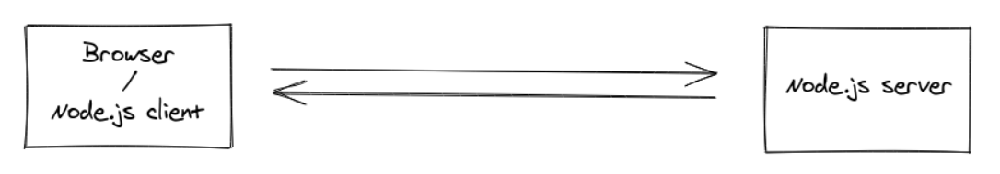

우리 프로젝트의 아주 중요한 핵심 기능 중 하나는 '실시간으로 진행되는 문제 풀이 기능'이다. **표준 웹소켓**을 이용해 구현하였다.  
http 통신만 해오다가 ws 통신을 하려니 시작 당시엔 나에게 꽤 큰 도전이었다. 거기다 (기획적인 면에서) 플로우가 제법 복잡했기에, 특히 처음 구현 시에 머리가 많이 아팠던 기억이 난다. 그래도 좋은 경험이 돼서 꼭 정리해봐야지 하다가... 벌써 반년도 넘게 미루다가 지금까지 왔다.ㅋ

그렇게 해서 (드디어) 이번 시리즈는 두 개의 포스팅에 걸쳐 해당 기능 구현을 위해 왜 WebSocket을 선택하였는지부터, 적용하며 마주한 문제 상황과 해결한 과정들을 정리하여 이야기해보려고 한다.

 
 
 

# 왜 WebSocket인가?

> ✅ **웹소켓(WebSocket)** : 사용자의 브라우저와 서버 간 지속적인 양방향 연결 스트림을 만들어 인터액티브 통신 세션을 설정할 수 있게 하는 기술이다. 개발자는 웹 소켓 API를 통해 서버로 메시지를 보내고 서버의 응답을 위해 서버를 폴링하지 않고도 이벤트 중심 응답을 받는 것이 가능하다.

## 실시간 통신의 필요성

문제는 한 문제씩 진행되며, 관리자의 제어(퀴즈 시작 및 종료, 문제에 대한 접근 및 답안 제출 허용)에 따라 퀴즈가 진행되기 때문에 실시간 통신이 가능해야 했다. '실시간 양방향 통신'이라는 특성에서 '양방향' 키워드가 빠지긴 했지만 실시간성이 매우 중요했기에, 폴링 방식보다는 웹소켓 통신을 시도해보기로 하였다.

 

  
User Flow 요약

  

  1. 사용자가 문제 풀이 페이지에 접속하면 대기 화면을 보여준다. = 문제 풀이 대기  
  2. 관리자가 문제에 대한 접근을 허용하면, 해당 문제를 보여준다. = 문제 접근 허용  
  3. 일정 시간이 지나면 문제에 대한 답안을 제출할 수 있도록 허용한다. = 문제 풀이 허용  
      - 답이 틀리면 오답 표시, 정답이면 정답 표시 후 다음 문제의 대기 화면으로 넘어감    
      - 답을 풀지 않고 그냥 다음 문제의 대기화면으로 넘어갈 수 있음  
      - 답안 제출은 선착순으로 관리하여 정답자 중 가장 빨리 제출한 사람을 해당 문제의 득점자로 산출  
  4. 문제가 끝날 때까지 2~3번을 반복  
  5. 마지막 문제 풀이 및 답안 제출이 끝나면 퀴즈 종료  
  

 

## WS? Socket.io? SockJS? STOMP?

### Socket.io

> ✅ **[Socket.io](https://socket.io/docs/v3/)** : 브라우저(클라이언트)와 서버 간에 실시간 양방향 통신을 가능하게 하는 라이브러리. Node.js 서버와 클라이언트측 Javascript client 라이브러리로 구성된다. 채널 개념이 존재하여 일부 클라이언트에게만 데이터를 전송하는 브로드캐스팅이 가능하다는 특징이 있다.

웹소켓을 쓰기로 결정하고 처음 구현을 시작할 때, 실시간 양방향 통신을 위해 많이들 사용하는 `Socket.io` 사용을 시도했었다. 그리고 문제풀이 기능은 로그인 된 사용자들만 사용할 수 있는 기능으로, 요청 시 사용자 인증이 필요했다.

Socket.io의 `extraHeaders` 옵션, `auth` 옵션을 통해 헤더에 토큰을 넣으려 했으나 연결에 계속해서 실패했었다. 그러다 request url에 'polling'이라고 들어있는 것을 보고 공식문서에서 힌트를 얻어 `transports` 옵션에 polling 대신 websocket을 추가해보았다. 그러고나니 연결을 시도하는 것에 대한 로그가 찍혔다. 이제 path는 맞는 것 같은데, 같이 보낸 토큰이 끝내 null로 뜨는 걸로 보아 headers는 여전히 빈 상태로 보내지고 있는 것을 알 수 있었다. 토큰을 서버에서 확인할 수가 없으니 당연히 인증에 실패하였고, 소켓에 연결도 할 수 없었다.

### STOMP + SockJS

그렇게 줄기차게 실패를 맛보고 담당 백엔드 멤버와 재조사 타임을 가졌다. 우리가 두 번째로 찾은 대안은 `STOMP`를 사용하는 것.

> ✅ **[STOMP(Simple Text Oriented Messaging Protocol)](https://stomp.github.io/)** : WebSocket와 같이 양방향 네트워크 프로토콜로, HTTP에서 모델링되는 프레임기반의 프로토콜이다. 서버와 클라이언트가 전송할 메시지의 유형, 형식, 내용들을 정의하는 매커니즘을 가져 효율적인 메시징을 가능하게 한다.

그리고 node.js에서 주로 socket.io를 사용하는데, 이는 socket.io가 node.js에 종속적이기 때문이라는 사실 또한 알게 되었다. spring에서는 STOMP와 함께 SockJS를 많이 사용하고, 애초에 스프링과 연동하여 작업하면서 socket.io를 사용하려 한게 실수였음을 깨달았다.

stomp를 사용하면 메시지에 header를 넣어줄 수 있어 헤더 기반의 사용자 인증이 가능하다. 따라서 STOMP + SockJS를 사용하는 것을 가장 효율적인 조합으로 보았다.

> ✅ **[SockJS](https://github.com/sockjs/sockjs-client)** : WebSocket과 유사한 객체를 제공하는 브라우저 Javascript 라이브러리. 브라우저와 서버 간에 대기 시간이 적고 양방향 교차 통신 채널을 생성하는 일관된 cross-browser Javascript API를 제공한다.

### WebSocket

그런데 왜 이걸 두고 표준 ws를 사용했느냐? stomp를 사용하면 클라이언트-서버 간 메시지를 전달하면 메시지의 내용뿐 아니라 그 메시지가 어떤 건지에 관한 정보도 함께 보낼 수 있다. 우리는 관리자가 취한 행동에 대해 서버 -> 클라이언트 쪽으로 신호만 줄 수 있으면 충분했기 때문에 그렇게까지 필요가 없다. 또, 표준 websocket을 사용한다고 해서 안정성 문제가 생기는 것도 전혀 아니기 때문에 굳이 라이브러리를 쓸 필요가 없다고 판단하였다.

> ✅ **[WebSocket](https://developer.mozilla.org/ko/docs/Web/API/WebSocket)** : 서버와 클라이언트 간 데이터를 주고 받을 수 있는 통신 프로토콜의 종류로, HTML5 웹 표준 기술이다. 서버에서 보낸 메시지에 대해 이벤트 기반으로 동작한다. 단순히 듣고 보내는 것만 가능하지만 매우 빠르고 가볍다는 장점이 있다.

 

그렇게 결국 돌고 돌아 WebSocket으로 채택되었다.  
<small>돌돌웹 ...</small>

 
 
 

웹소켓을 처음 접해보는 그 당시에는 찾아보면 뭔가 굉장히 많이 나오는데 뭐가 뭔지도 모르겠고 어떤게 가장 적절할지 선택하는 과정이 쉽지 않았어서, 이렇게 표준 ws를 선택하게 된 과정과 함께 헷갈릴 수 있는 키워드들의 개념을 간단히 정리해보았다.

이렇게 해서 웹소켓 적용기 1편은 React + Spring 환경에서 웹소켓 사용을 위해 마주한 이슈들과 고민한 과정을 담은 것으로 마무리하겠다. 곧 돌아올 2편(2부작ㅎ)에서는 WebSocket 사용법 기초에 대해 소개하며 본격적으로 웹소켓을 적용해보며 마주한 문제들에 대한 트러블 슈팅을 기록할 예정이다. 많관부!

 
 
 

---

참고 :  
[WebSocket ㅡ mdn web docs](https://developer.mozilla.org/ko/docs/Web/API/WebSocket)  
[웹소켓과 socket.io](https://www.peterkimzz.com/websocket-vs-socket-io)  
[이노베이션 캠프 실전(챕터1. 채팅-Socket.io, SockJS, stomp)](https://velog.io/@thfl3363/%EC%9D%B4%EB%85%B8%EB%B2%A0%EC%9D%B4%EC%85%98-%EC%BA%A0%ED%94%84-%EC%8B%A4%EC%A0%84-%EC%B1%95%ED%84%B01.%EC%B1%84%ED%8C%85)
