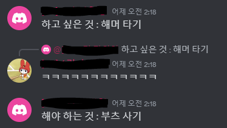

# 하고 싶은 것 vs 해야 하는 것

삶에서 하고 싶은 것도 많고 해야 하는 것도 많다.  
그리고 대체로 해야 하는 것은 하고 싶지 않다는게 문제이다.  

둘 중에 뭐가 더 중요한지에 대해서 이야기하는 글은 아니다. 꼭 다 큰 어른이 아니더라도 세상을 좀 살다보면 둘 중 뭐가 더 중요한지는 중요하지 않다는 것을 알게 되기 때문이다. 이 두 가지는 둘 중 하나를 고르는 선택지 같은 것이 아니다.  

 

해야 하는 것은

보통 나에게 필요하거나 도움이 되는 일인 경우가 많다. 그렇기 때문에 많은 사람들이 할 일을 두고 '하기 싫다, 하기 싫다' 거리면서도 그 고통을 참아가며 하는 거일 것이다.

 

하고 싶은 것은

'그냥 하고 싶어서'  
'하고 싶으니깐'  

이게 맞다 사실  
여기서 내가 따로 말하지 않아도 하고 싶은 건 ~~못 참는~~ 참기 힘든 것이 인간이기 때문에 아마 다들 잘 하고 있을 거라 생각한다. 오히려 하고 싶은 것에 대한 욕구가 해야 하는 것을 인지하는 이성을 이길 때가 많아서 문제라면 모를까.

↓

일단 나의 경우엔 그렇다... 솔직히 사람은 누구나 달라서 해야 하는 것에 치여 정작 하고 싶은 일이 뭔지도 모른다거나 하고 싶은 것을 하는 일을 잊어먹는 사람도 있을 것이다.

 

그래서 이거랑 관련해서 요새 고민인게 하나 있다.
나랑 가까운 사람들은 다 알겠지만 나는 보드 타는걸 좋아한다.

<small>스노우보드ㅎ.ㅎ</small>

근데 이제 올 겨울에 보드를 즐기지 못 할 수도 있는 ... 그런 상황에 처해 있다.
시즌권을 구매하고 개인 용품을 구매해서 본격적으로 타기 시작한건 1년밖에 되지 않았다. 그 전에는 관광으로 5~6회 정도 갔던 것 같다.  
보드를 입문하면 생각보다 비용이 정말 많이 드는 취미라는 걸 알 수 있다.  
시즌권에 시즌방에 시즌셔틀에...  
옷도 상하의 각각 기본 2~30만원은 물론이고 고글에 장갑에 자잘한 바라클라바, 워머, 보호대 등등이 있고 (여기에만 일단 80?은 들었다)  
장비는 뭐  
부츠 데크 바인딩 이렇게 세 가지가 기본인데 얘네만 다 맞춰도 솔직히 200 이상은 무조건 쓴다고 생각해야 한다. 참고로 좋은거 기준 아님

그렇다고 돈만 많이 드는 것도 아니고... 보드 한 번 타러 가는데 접근성이 참 안좋다. 집 근처나 동네에서 즐길 수 있는 스포츠가 아니기 때문에... 한 번 갈 때 시즌방에 며칠 묵다 오는 걸 생각해도 왔다갔다 하는 데에 체력도 시간도 결코 적게 들지 않는다. 물론 이 정도 힘듦은 보드를 사랑하는 내 마음에 비하면 아무것도 아니기 때문에 힘든 일이 아니다.

진짜 문제가 되는 건 아무래도 시간과 돈이다.  
지난 시즌에는 부모님의 지원+통장털이 로 개인 장비만 빼고 제법 갖출걸 갖춰서 제대로 즐길 수 있었다.

는 시간이 부족해서 뽕을 못 뽑았다 ...ㅜ

이제 4학년 취준의 시기에 접어들었고, 대학생 1학년처럼 마냥 하고 싶은 것들을 생각하며 놀 시기는 지났다. 지난 시즌만 해도 시간이 부족해서 얼마 못 갔다고 했는데, 그 얼마 못 간 것마저 노트북을 들고 가서 야간보딩하고 들어오면 코딩하고, 아침 챙겨먹고 나가기 전에 코딩하고, 그랬다.

해야 하는 일이 있지만, 하고 싶은 것도 포기할 수 없었고,  
하고 싶은 마음이 굴뚝 같지만, 쌓여있는 할 일들을 외면할 수 없었다.

흔히 해야 하는 일이라고 하면 생각나는, 공부, 과제, 학회 활동 등등이 아니어도, 취미 또한 할 일이라고 생각한다. 좋다고 이것'만' 하면 안된다는 거지, 취미 생활도 학교 생활, 직장 생활 못지 않게 우리 삶에서 필요한 일이다.   좋아하는 일은 어떤 다른 일을 하는 것에 있어서 그 무엇보다 커다란 동기가 된다. 일상에 활력을 불어 넣어주고, 열심히 살아갈 이유를 만들어 주기도 한다. 

나에게 보드는 그런 존재이다. 겨울에만 즐길 수 있고, 우리나라는 겨울이 일년 중 반도 안되기에 봄 여름 가을엔 겨울만 목 빠지게 기다리기는 하지만  
상상만 해도 너무 흥분되고 설레고 그렇다. 나는 이렇다 할 취미가 많이 있는 편이 아니라, 이만큼 좋아하는 게 생겼다는 것만으로도 사실 감사하기도 하다.   아침잠이 유독 많고 일찍 일어나는걸 제 의지론 죽어도 못하는 내가, 스키장 가는 날에는 오전 4시반이라는 시간에 벌떡 일어나는 것만 해도 사실 말 다 했다. 

올해 하반기에는 지난 겨울보다 더더욱 여유가 없을 테니, 저번 시즌보다도 훨씬 못 즐길 확률이 높다. 아니 사실상 확정이다.. 비용이라도 안들면 모를까 두세번 즐기자고 저 큰 비용을 들일 형편은 안된다.  
사실 몇십만원이 직장인에게 자기가 정말 좋아하는 것에 대해 투자하는 돈이라 하면 엄청 큰 돈은 아닐 것이다. 그치만 나는 아직 학생이고, 취준을 해야 하니 더 크게 느껴지는 건데, 그래서 오히려 <strong>'지금 하고 싶은 걸 조금 참고, 해야 하는 일에 집중해서 나중에 능력 있는 어엿한 어른이 되면 본격적으로 하자'</strong>라는 생각도 한다.  
솔직히 보드를 거의 못 탈 생각을 하면 벌써부터 너무 슬프고 조금 우울하지만... 하고 싶은 걸 하기 위해서는 해야 하는 일을 해야 하는 법이다. 

지금 취미 마음껏 즐기기 vs 지금 조금 참고 나중에 제대로 즐기기

조금만 생각해봐도 뭐가 더 진짜 우울할지 사실 답은 나온다.  
아예 못 하는 것도 아니고, 지금의 불안정한 상황에서 벗어나면 나중에라도 얼마든지 이룰 수 있는 것이기 때문에, 나는 큰 그림을 전략적으로 세우는 것이다.ㅎㅋ

이렇게 어른이 되어가는 거겠지  

 
 
 

---
삶의 모든 순간에 하고 싶은 것과 해야 하는 것 사이에서 갈등과 선택을 반복할 수 밖에 없을 것이다. 인생은 순간의 선택들이 모여 만들어지는 것이니, 그 때에 우리는 현명하게 생각하고 선택할 줄 알아야 할 것이다. 

 
 
 

  
<small>ㅋㅋㅋㅋㅋㅋㅋㅋㅋㅋㅋㅋㅋㅋㅋㅋㅋㅋㅋㅋㅋㅋㅋㅋㅋㅋㅋㅋ</small>

그치만 이건 걍 개웃김 하..^^