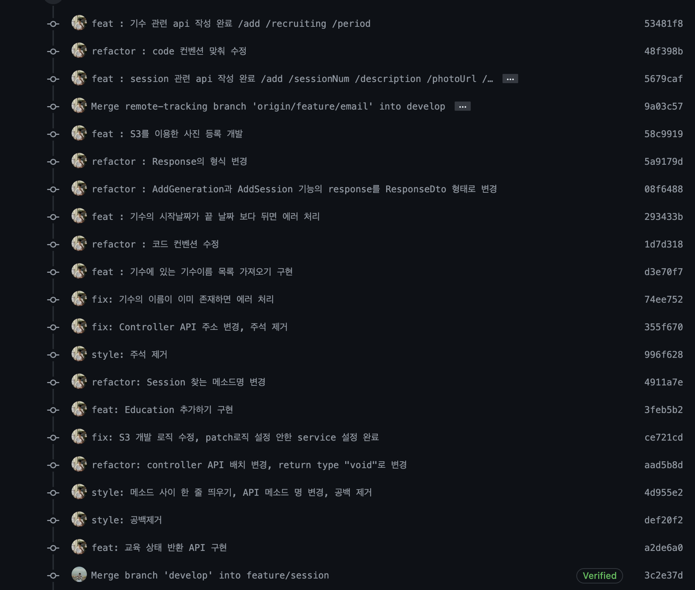
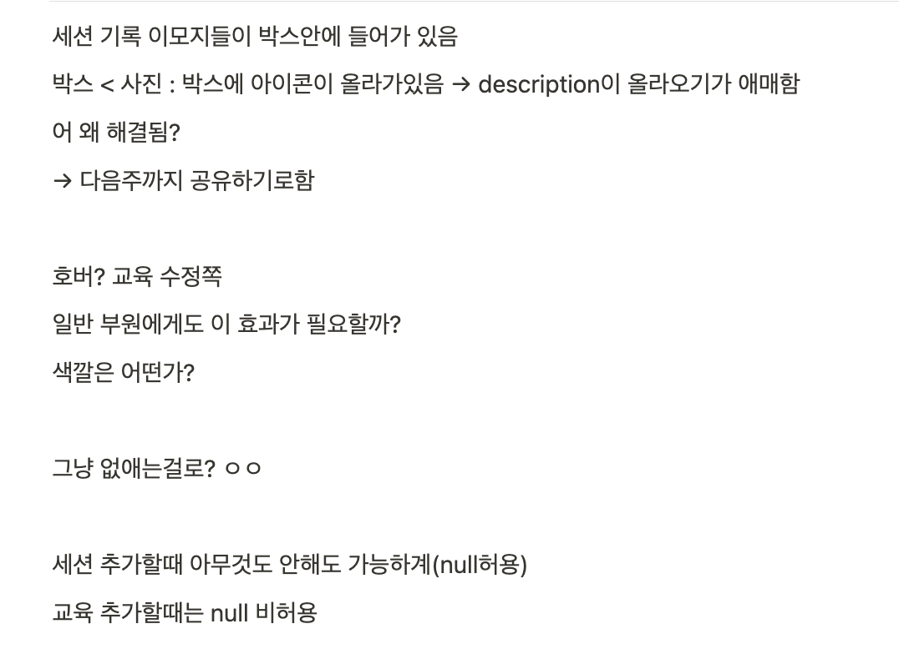
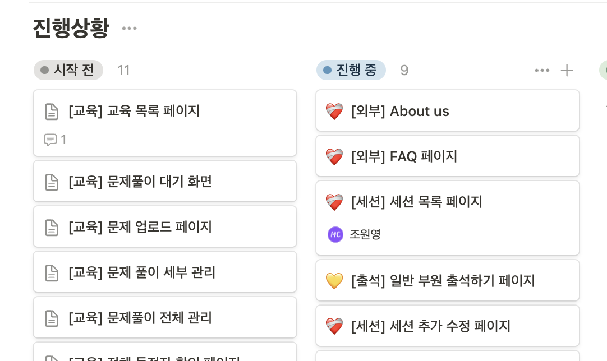
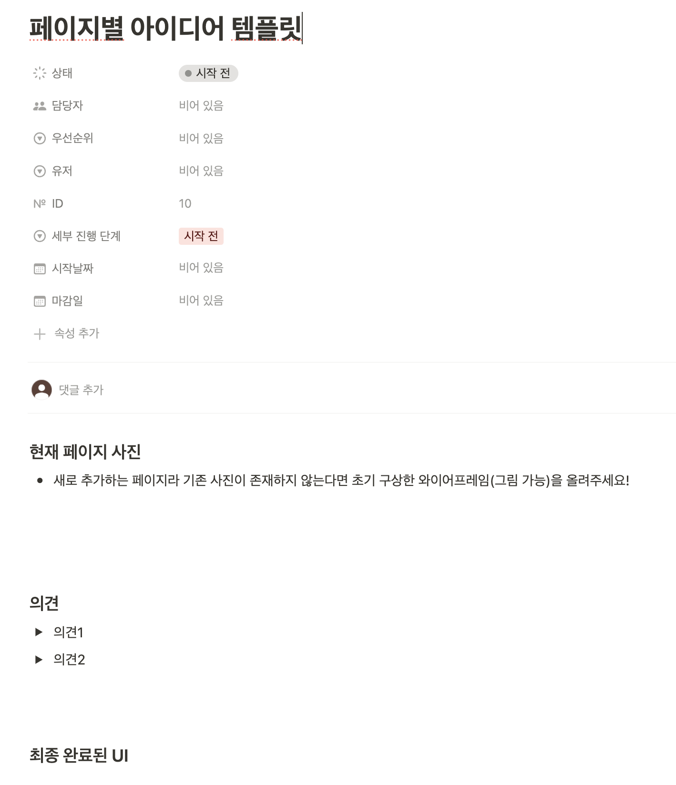

# 선착순 퀴즈 프로젝트 회고록

지난해 10월부터 진행한 **선착순 CS퀴즈 프로젝트의 버전1**이 마무리되고 이제 버전2를 운영 중이다.

버전2에선 해당 사이트를 동아리 홍보 사이트, 운영 과정에서 부원 필요 기능 추가 등을 목적으로 확장 중에 있는데 보다 나은 버전2 개발 진행을 위해 프로젝트를 진행하며 느낀점, 리팩토링 과정에서 느낀 아쉬움과 운영 과정에서 필요를 느낀 내용에 대해 KPT 회고를 해보고자 한다.

### 선착순 퀴즈 프로젝트란?

사전에 등록된 문제에 대해 관리자가 실시간으로 문제 풀이가 진행된다. 이 중 가장 빠른 정답자를 득점자로 인정하고 이를 통해 우승자를 결정하는 프로젝트이다.

### 기획 의도

7, 8기 교육팀으로 활동하며 교육을 진행하고 CS퀴즈를 진행했다. 기존 기수엔 카카오톡 채팅방을 통해 아래와 같이 가장 빠른 정답자를 득점자로 인정했다.

하지만, 이 방식은 진행 상황에 따라 참여율이 떨어지는 문제가 많았다.

1. 공개된 채팅방에 ‘오답’을 제출하기 두려워 풀이를 하지 않는 부원이 발생
2. 5번 문제 이후 우승자가 어느정도 결정되면 더 이상 풀이를 참여하지 않는 문제 발생

매주 회의를 하고 문제를 만드는데 참여율이 떨어지는게 너무 아쉬웠고, 이를 개선하기 위해 카카오톡 채팅방이 아닌 별도의 서비스가 있으면 해결되지 않을까? 하는 생각과 이런 생각에 공감하는 동아리에 애정 넘치는 팀원을 모집해 기획(1), 디자인(2), 프론트(3), 백엔드(3)의 전체 및 백엔드 팀장으로 프로젝트를 시작했다.

## 목표

### 동시성 문제를 겪고 해결해보고 싶다.

‘프로젝트에 CS지식을 녹여내라’ 신입 백엔드 개발자가 면접에서 어필할 수 있고 가장 필요한 역량이라고 생각한다. ‘이론’을 이론으로만 알고 있는게 아니라 실전으로 적용하고 활용할 줄 안다는 얘기니까.

단순 CRUD만 하는 coder가 되고 싶진 않은데, 그렇다고 기술을 필요 이상의 오버스택을 선택하는건 더 최악의 방법이다.

다행히 내가 필요성을 느끼고, 관련이 깊은 주제에 좋은 소재가 있었다. 교육팀 CS퀴즈의 핵심 요소는 ‘선착순’이다. 따라서, 지정된 시간에 동시에 많은 사용자들이 요청을 보낼텐데 이 요청들 사이에서 ‘순서’를 충돌없이 구분하는 것은 CS를 프로젝트에 녹이는 꽤 좋은 소재가 될 수 있을 것이라 생각했다.

### 개발하고 끝이 아닌 운영되는 서비스를 만들고 싶다.

여러 백엔드 개발자 모집 공고를 보면 필요 역량 중 ‘실제 유저가 존재한 서비스를 운영한 경험’부터 시작해서 ‘대용량 트래픽을 겪어본 경험’과 같은 요소들이 보인다. 

하지만, IT연합동아리들의 데모데이를 보며 괜찮다고 생각한 대부분의 서비스는 유저를 유치하는 것이 어렵기 때문에 데모데이 이후에 운영되지 않고 종료되는 것들이 많았다. 

즉, 개발만 되고 운영되지 않는게 많았다. 저러한 역량이 필요한 이유는 로컬 환경과 배포환경에서 얻을 수 있는 경험이 다르듯 ‘유저’의 사용을 얻을 수 있는 또 다른 경험이 있을 것이라고 생각했다.

그래서 많지는 않아도 동아리에서 사용할 수 있는 프로젝트, 내가 필요성을 느낀 주제니까 유저를 확보할만하고 운영 과정에서 많은 이슈를 만나고 피드백 받으며 개선하고 성장할 수 있지 않을까 하는 생각이 들었다.

## Keep : 잘하는 점 계속하고 싶은점

### (팀) 꾸준한 대면 회의를 통한 의사소통 효율 향상

우리팀의 회의 원칙은 파트별 최소 1인 대면 회의 참석이 원칙이다. 10월부터 8달간 시험기간을 제외하곤 비대면으로 회의를 진행한 적이 없다.

꾸준히 대면으로 의사소통을 한 덕에 1주일에 2시간밖에 진행되지 않는 전체 회의에서 기획적인 부분에 잘못된 이해없이 진행되는 것은 팀원들의 목소리만 듣는 것이 아닌, 팀원들의 표정, 행동과 같은 비언어적 행동이 설명하고자 하는 내용을 부연해주기 때문이라 생각한다.

이해가 되지 않을 경우, 바로 ipad 또는 화이트 보드를 통해 그림을 그려가며 의사소통을 하는 것 또한 우리 프로젝트 의사소통의 큰 강점이다.

### (개발) 빠르게 개선한 브랜치 전략

프로젝트 초기엔 도메인에 따른 브랜치만 만들어 개발을 하고자했다. 하지만, 이런 경우 **브랜치를 재활용**하게 되고 squash and merge를 선택한 팀 깃 전략에서 아래와 같이 커밋이 쌓여 코드리뷰에 어려운 문제가 있었다.

따라서, 빠르게 git-flow를 참고해 `develop` 브랜치를 베이스로 개발하려는 내용에 대한 전용 브랜치를 만들고 merge 후엔 재사용하지 않는 방법을 사용했더니, 코드리뷰, PR관리, develop 브랜치 관리에도 용이했다.

## Problem: 문제가 있다 싶은점, 변화가 필요한 점

### 정리되지 않은 문서화

1. 회의록 및 기획 관련 문서화 미흡
    
    대면회의로 소통은 수월하게 진행됐고 회의록 또한 기록은 열심히 했지만 마땅한 ‘문서 정리’ 작업은 체계적으로 하지 못했다. 그러다보니 분명 회의때 다룬 내용인데 ‘전에 이야기했던 부분인데..?’ 하며 복기하는데 어려움이 있었고, 중간, 기말고사 등의 이유로 팀의 모두가 바빠지는 시기가 오면 그 다음 회의는 시작할때 갈피를 잡기 어려웠고 추후에 언급하기로 했던 내용이 다음에 언급될때면 이전 기억을 떠올리는 시간이 길어졌다.
    
    
    
    대충 … 봐도 알기 어려운 버전1 회의 기록
    
2. 개발 문서 미흡
    
    개발 문서 작성 또한 미흡했다. 팀원 모두가 프로젝트 경험이 부족했기에 개발과정에서 다양한 소스 참고
    
    ‘일단 구현부터 해보기’도 했다. 하지만, 구현에만 집중한 코드는 유지보수하기엔 필요이상의 비용을 요구했다.
    
    > 남이 보기 좋은 코드의 남에는 ‘미래의 나’도 포함이 되어있다.
    > 
    
    데모데이가 끝난 3월 이후 리팩토링을 하는 과정에서 **이건 왜 이렇게 했지?** 하는 부분들이 너무 많았고, 이미 운영 중인 프로젝트 코드의 손대는 것은 단순히 배포된 코드의 유지보수와는 비용 자체가 다르다는 것을 느꼈다.
    
    추가로, 개발 기록에 관한 문서도 부족했기에 기술을 선택한 이유, 장단점에 대한 이해도 부족했고 이는 결국 ‘돌아가기만 하는 프로젝트’의 타이틀에 그칠 수 밖에 없다.
    

### 테스트 방식 부족

별도의 개발 과정에서 테스트 코드를 작성하지 않았다. TDD까지는 아니어도 테스트 코드, 프레임워크를 통해 기능 테스트를 해볼 필요가 있었는데 우리는 별도의 테스트 코드를 작성하기보단 Postman을 통해 테스트 하고, 코드리뷰 과정에서 동료의 테스트, API연결 과정에서 프론트엔드 개발자의 테스트정도로 끝났다.

하지만, 이러한 방식은 내부 로직 테스트가 불가능하다는 점, 사용자에게 뒤늦게 발견될 이슈가 많다는 점 등 문제가 확실했다. 운영되는 과정에서 불필요한 이슈가 발생하지 않게 전체적인 테스트 플로우를 확립할 필요가 있다고 느꼈다.

## Try: 더 잘하기 위해, 문제를 해결하기 위해 시도해볼 것

### 대면 회의록 작성 및 복기

회의록을 기록하는 것에서 멈추는 것이 아닌 ‘UI, 기능 단위로 작업’을 분리해 회의가 끝난 후 별도로 의견을 정리하는 탭을 만들었다.

이후 기획자 또는 팀장만 회의록을 정리하는 것이 아닌 파트별로 매주 정리 담당을 변경해 회의록 정리를 팀원 모두의 작업으로 분배해 돌아가는 태스크에 대한 이해를 팀원 모두가 할 수 있게 개선했다.

### 이슈 티켓 관리 및 브랜치별 티켓 관리

브랜치를 생성할 때 단순히 `feature/update-session-description` 이런 식의 브랜치 생성은 최초로 사진 설명 수정 기능을 개발 후 이후에 다시 같은 기능의 브랜치를 만들때 이름의 충돌을 야기할 수 있었다.

보통은 실무에서 JIRA를 통해 github와 연동해 브랜치를 만드는데 우리는 협의 끝에 노션에 별도의 일정탭, 스프린트 탭을 만들어 작업을 생성하고 별도의 티켓번호를 발급 받기로 했다.

이렇게 하면 해당 보드에 브랜치별 이슈를 남길 수 있어 코드리뷰에 용이할뿐더러 전체적인 작업 관리에도 수월해질 수 있다는 장점이 있다.

### 간단하게라도 이유와 과정 기록하는 문화 만들기

버전1에선 ‘일단 구현을 해보자’가 초점이었다고 생각한다. 그렇게 되니 나중에 ‘왜 이걸 이렇게 했지?’라는 질문에 ‘그냥’ 이라는 대답만 나오기 쉬웠다. 이를 방지하기 위해선 간단하게라도 이유와 과정을 기록할 필요가 있었다. 

개발 팀에서도 이슈 템플릿, 개발 기록 탭, 개인 블로그를 활용해 기술 선택, 방식등의 이유를 남기는 방법을 만들고 있고 ‘[개발 블로그 쓰기 스터디 1기](https://github.com/IT-Cotato/9th-Dev-Blog-Study)’를 개설해 개인적으로도 글 쓰는 습관을 확실히 다지고자 했다.

이 방식이 확장되어 동아리에선 현재 본 개발팀 외에도 ‘개발, 기획, 디자이너’ 모두가 참여하는 ‘개발*기획*디자인 블로그 쓰기 스터디’가 진행되어 11명 정도가 글쓰는 습관을 기르고 있다.

[개발 블로그 쓰기 스터디 2기 소개 노션](https://www.notion.so/2-6cce67e1dd6d4479915c134f996c0476?pvs=21)

### 느낀점

1. 받을 수 있는 유저가 제한적인 것에서 오는 아쉬움.
    
    실제 동시성 문제를 해결한 로직, 웹소켓 연결 테스트 등 운영하며 유저로부터 깨닫고 배우는 부족함들이 많다. 하지만, 우리는 ‘현재 활동하는 동아리 부원’을 타켓 유저로 잡고 진행되고 있기에 더 많은 유저를 확보하고 이슈를 겪는 것은 당장에 어렵다.
    
    물론 타겟 사용자나 서비스를 외부로 타겟팅해서 분리해 해결할 수 있지만, 현재 우리 팀의 목표가 ‘많은 사용자’이기 전에 동아리원들의 편리와 동아리 홍보에 있기에 이는 기다리고 조금 차근차근 확장해 나가야할 것 같다.
    
2. ‘대단함’ 보단 ‘탄탄함’을 추구하자.
    
    리팩토링하는 과정에서 정리한 내용은 대부분 고난도 프레임워크, 언어에 관한 내용이 아니었다. 오히려 CS 이론에 관한 내용이 훨씬 많았다. ‘동시성 문제’, ‘HTTP 멱등성’, ‘캐시’, ‘서버 → 클라이언트의 통신 방법’, ‘인증 과정’, ‘쿠키를 통한 리프레시 토큰 구현’ 과 같은 내용은 다 3,4학년 전공 수업에서 배운 기초가 되는 내용들이다. 다만, 이를 실습을 제대로 해본 경험이 없어 어렵게 느꼈을 뿐이다. 
    
    프로젝트에서 적용한 CS내용을 정리하며 ‘탄탄하게’ 머리에 쌓인다는 느낌을 많이 받았는데 이 느낌이 내가 오래 개발자로 버틸 수 있는 힘이 아닐까.
    

### 버전2에는?

버전2에는 이러한 문제를 종합해서 보다 나은 시작과 과정, 보다 높은 완성도를 갖추고 싶다. 개인적으론 단단한 나의 포트폴리오, 동아리적으론 누가봐도 코테이토 대표 프로젝트가 될 수 있게 흠없고 자랑스러운 프로젝트가 되었으면 좋겠다는 생각이다.

지금까지 과정에서도 많이 성장했지만 이렇게 프로젝트, 동아리와 같이 성장하는 계속 그러한 프로젝트가 되었으면 좋겠다.

다들 조금 더 고생하자 ㅋ
