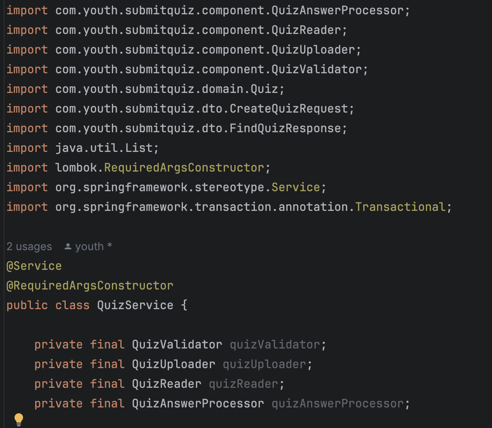
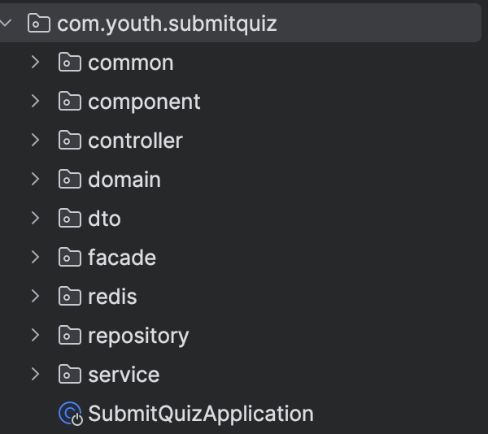
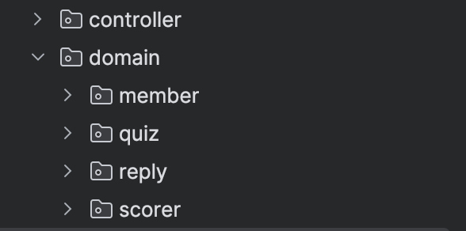
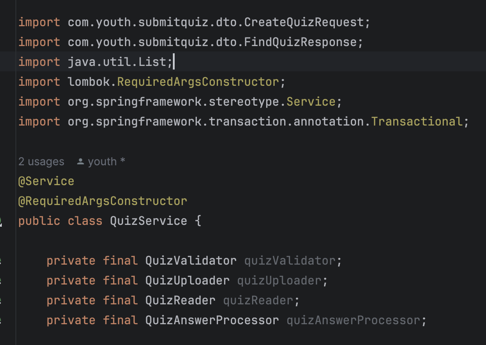
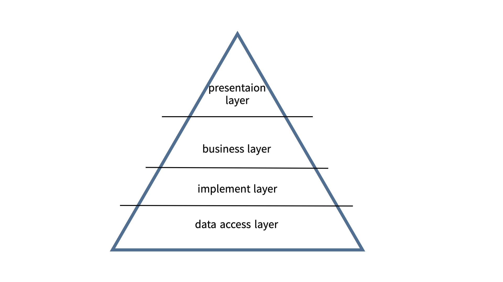
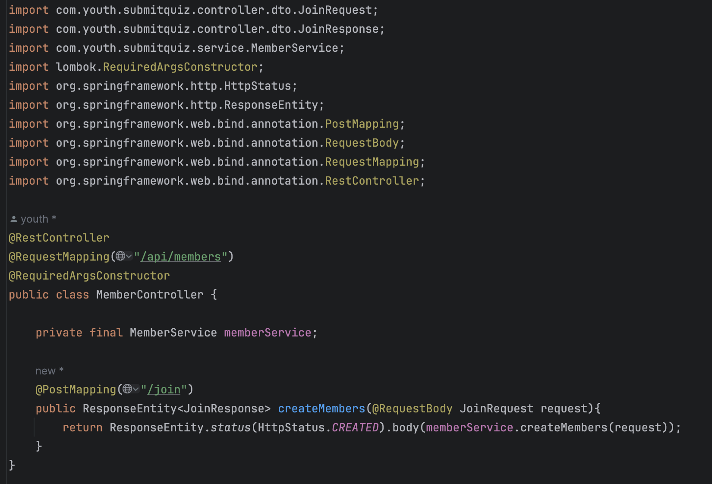
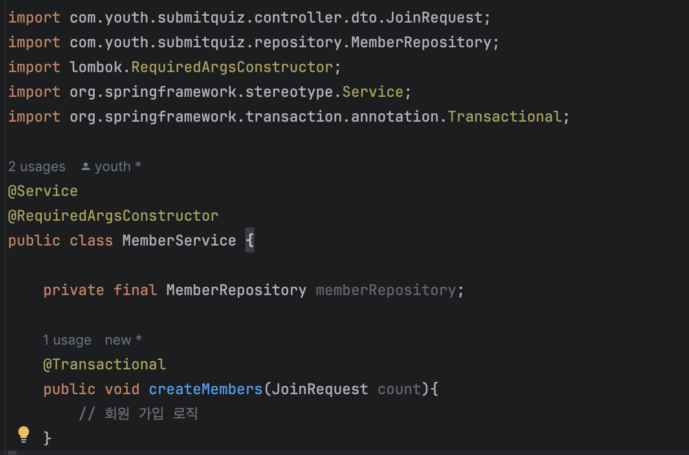
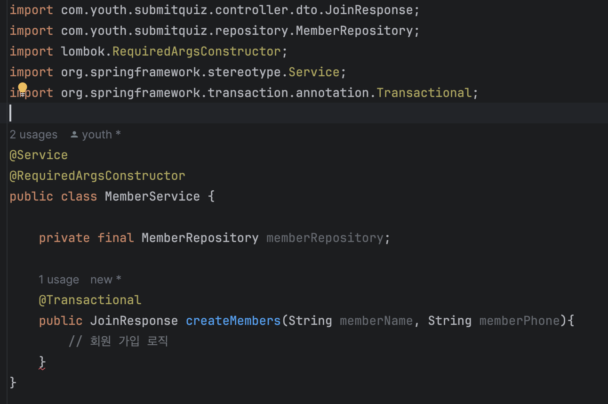
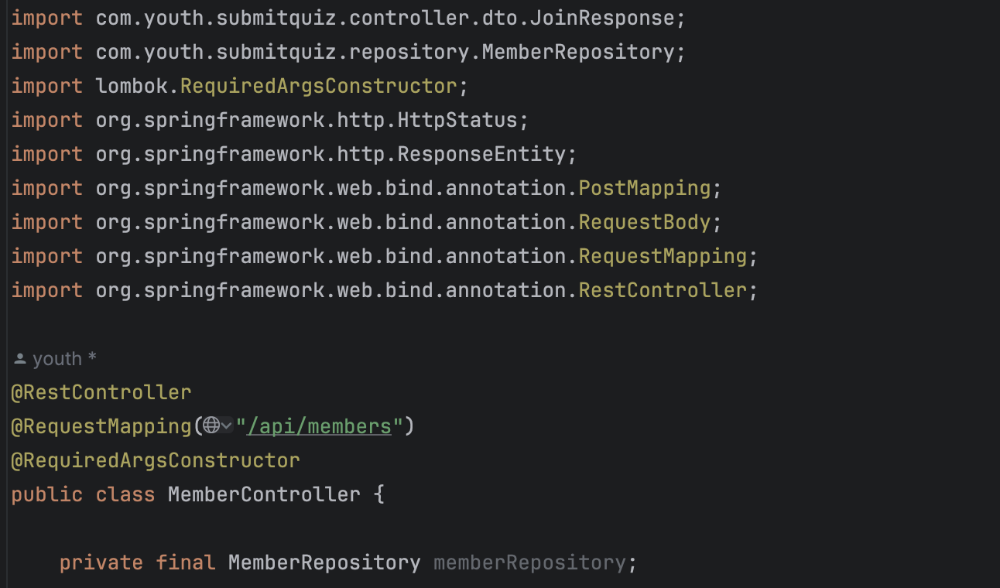

# 지속 성장 가능한 코드: import도 코드

어느 덧 9기가 끝나가며 자신있게 출시(?)한 프로젝트를 운영한지도 6개월이 되어간다.

그냥 박치기로 시작했던 프로젝트를 운영까지 하고 있으니 리팩토링을 하거나 새로운 기능을 짤 때 ‘변경한 코드의 파급력’을 고려하지 않을 수가 없다. 

그렇다고 확장을 하지 않을수도 없는데, 크고 작은 기능이 추가되며 하나의 클래스에 메서드가 증가하고 의존성이 더해지며 코드가 복잡해지는데 기수가 끝나가는 하나의 전환점인 지금 아래와 같은 고민이 생긴다.

> 지금 우리의 프로젝트는 새로운 개발자가 와서 읽기 좋은 구조인가?
> 

언젠가는 누군가가, 적어도 ‘홍보’ 관련 도메인은 가져가야하는데 이게 맞나 싶은 포인트가 생겨 고민이 드는 요즘이다.

### 이게 맞나?

`import 문에 와일드 카드 사용을 하지말자` 라는 코드 컨벤션 덕에 코드리뷰를 하다보면 import문만 수십개인 것을 볼 수 있다.

<details>
<summary>의존이 많이 생기다보니 꽤 많은 import 문이 존재함.</summary>

```java
package org.cotato.csquiz.domain.generation.service;

import jakarta.persistence.EntityNotFoundException;
import java.util.List;
import java.util.Map;
import java.util.stream.Collectors;
import lombok.RequiredArgsConstructor;
import lombok.extern.slf4j.Slf4j;
import org.cotato.csquiz.api.attendance.dto.AttendanceDeadLineDto;
import org.cotato.csquiz.api.session.dto.AddSessionRequest;
import org.cotato.csquiz.api.session.dto.AddSessionResponse;
import org.cotato.csquiz.api.session.dto.CsEducationOnSessionNumberResponse;
import org.cotato.csquiz.api.session.dto.SessionListResponse;
import org.cotato.csquiz.api.session.dto.UpdateSessionNumberRequest;
import org.cotato.csquiz.api.session.dto.UpdateSessionRequest;
import org.cotato.csquiz.common.error.exception.ImageException;
import org.cotato.csquiz.domain.attendance.embedded.Location;
import org.cotato.csquiz.domain.attendance.service.AttendanceAdminService;
import org.cotato.csquiz.domain.education.entity.Education;
import org.cotato.csquiz.domain.education.service.EducationService;
import org.cotato.csquiz.domain.generation.embedded.SessionContents;
import org.cotato.csquiz.domain.generation.entity.Generation;
import org.cotato.csquiz.domain.generation.entity.Session;
import org.cotato.csquiz.domain.generation.entity.SessionImage;
import org.cotato.csquiz.domain.generation.enums.CSEducation;
import org.cotato.csquiz.domain.generation.repository.GenerationRepository;
import org.cotato.csquiz.domain.generation.repository.SessionImageRepository;
import org.cotato.csquiz.domain.generation.repository.SessionRepository;
import org.springframework.stereotype.Service;
import org.springframework.transaction.annotation.Transactional;
```
</details>

<br>

<details>
<summary>하나의 서비스 클래스에 과한 의존이 생기는 경우</summary>

```java
@Service
public class SessionService {

    private final SessionRepository sessionRepository;
    private final GenerationRepository generationRepository;
    private final SessionImageRepository sessionImageRepository; // service가 있는데 얘는 왜 있는거지?
    private final AttendanceAdminService attendanceAdminService;
    private final EducationService educationService;
    private final SessionImageService sessionImageService; // 
    
    //..
}
```
</details>
    

이렇게 복잡해지는 코드를 보며 아키텍처에 대한 공부를 해야하나? 디자인패턴에 대한 공부를 해야하나? 싶은 상황에서 관련해서 유튜브도 찾아보고 이곳 저곳 의견을 구해보기도 하다가 토스 테크의 블로그를 읽던 중 이런 고민을 조금 해결해주는 내용을 찾았다.

[토스 Slash 22: 지속 성장 가능한 코드를 만들어가는 방법(김재민)](https://www.youtube.com/watch?v=RVO02Z1dLF8)

import문을 줄여가며 프로젝트 구조를 잘 잡게 되면 코드가 조금 더 나아지지 않을까 하는 생각에 이 글에선, import문도 하나의 코드라는 관점에서 보다 나은 코드를 작성하는 방법을 정리해보고자 한다.

(이하의 내용은 토스 유튜브의 3가지 방법 중 2가지(package, layer)를 참고해 정리하고 이해하며 적용한 내용입니다.)

## Package

java에서 클래스 위에 import문은 아래와 같은 기준으로 존재하거나 존재하지 않는다.

- 참고하는 클래스가 같은 패키지에 있다면 외부에서 불러올 필요가 없기 때문에 import문이 존재하지 않는다.
- 반대로 다른 패키지에 있으면 ‘어디에 누구’를 참고할 것인지 명확해야하기에 아래와 같은 package를 명시한 import 문이 존재한다.
    
     예시](images/image1.png)
    AttendanceService.java 예시
    

2가지 의문이 들 수 있다.

1. 파일의 위치라면 directory라는 이름이 있는데 왜 이름이 package인가?
2. 보통의 순서는 cotato.org(organization)인데 왜 역순(org.cotato)일까? 

package를 한글로 하면 ‘포장’이란 뜻을 가지고 있다. 

<br>

**햄버거 포장 예시**

이에 맞게 햄버거 세트를 포장하는 경우를 생각해보자. 구성품은 ‘햄버거’, ‘콜라’, ‘감자튀김’이다.

이 3가지 구성품을 포장할 때 하나의 종이 봉투에 다 때려박으면 이 구성품을 햄버거 세트라고 할 수는 없을 것이다. (감자튀김과 콜라와 햄버거 패티가 하나의 봉투에 섞여있으면..?)

햄버거는 종이 또는 작은 박스에, 콜라는 별도의 잔에 뚜겅을 덮어서, 감자튀김 또한 별도의 용기에 담고 이 3가지를 하나의 큰 봉투에 담아서 받아야 그것이 비로소 제대로 된 햄버거 포장일 것이다.

아직 예시가 부족하다면 ‘최소 주문 금액에 따라 100개의 햄버거 세트를 포장해야하는 경우’를 고려해보자.

“햄버거는 하나의 박스에, 콜라는 캐리어에, 감자튀김은 별도의 박스”에 이렇게 비슷한 메뉴를 한 곳에 **묶어서 포장**하는 것이 효율적일 것이다. 

코드 패키징 또한 똑같다. 코드와 패키지를 짤 때 전략에 따라 **비슷한 것끼리 잘 응집**하는 것이 중요하다.

햄버거 얘기가 너무 많았는데 코드로 예시를 들어보자.

**코드 예시**

아래의 Service 클래스의 import문을 보자.



같은 도메인(Quiz)의 다른 서비스나 컴포넌트들을 많이 import한다.



위와 같은 패키지 구조이기 때문에 관심사가 비슷한 것끼리 붙어있지 않아서 import문이 과하게 증가한다.

이를 적절하게 관심있는 부분만 비슷하게 패키징을 하면 import문을 간결하게 조정할 수 있다.





Quiz와 관련된 import문이 사라졌다. 

아니면, 아래와 같이 조금 더 구체적인 추상화를 해도 적어도 비슷한 도메인에 있어서 괜찮다. 뭐 그런 얘기

우리 프로젝트에서도 패키지 구조를 이번(V3)에 수정했다.

기존 구조는 아래와 같은 기본 

이번엔 계층형 구조를 선택했다.

다시 위 2가지 질문에 대한 답은 얘기가 길어지니 짧게 토글로 전달하겠다

- 왜 이름이 package(포장, 꾸러미)인가?
    
    코드의 비슷한 부분을 묶어서(응집해서) 관리하기 위함.
    
- 왜 cotato.org가 아닌 org.cotato의 순서인가?
    
    대분류 → 소분류로 들어가면서 비슷한 것끼리 묶기 위함
    
    밖에서 부터 포장을 까 들어가는 큰개념이 바깥에 있어야하는 것
    

## Layer

일반적인 서버 어플리케이션의 레이어는 아래와 같다.



우리는 business 계층과 implementation 계층이 사실 동일하게 사용하고 있긴하다.

서버의 일반적인 layer이다. (토스에서도 위와 같은 기본 레이어를 사용하고 있다고 한다.)

<details>
<summary>4가지 계층에 대한 설명</summary>
아래로 갈수록 DB와 가까워지고, 위로 갈수록 web(유저, client)와 가까워진다.
    
- presentation layer: 사용자와 맞닿은 부분
    - Controller(API), 외부 클라이언트와 전달하는 (request, response)
- business layer: 비즈니스 로직이 존재하는 부분
- implement layer: 비즈니스 로직을 실제로 구현하는 부분
- data access layer: DB 접근
</details>
    
<br>

Layer에 대한 Rule이 3가지 존재하는데 하나씩의 룰을 통해 import문을 관리하는 방법을 설명해보겠다.

### 1. 상위 layer → 하위 layer로 순방향 참조를 진행한다.

상위 layer의 클래스는 하위 layer의 클래스를 참조가 가능하다.

즉, Controller 에서 service 클래스 참조가 가능하고, service에서 구현 클래스 참조(import)가 가능하다.

아래 Controller는 같은 계층(request, response)과 하위 계층(service)를 참조하고 있기에 꽤 좋은 예시이다. 



### 2. 하위 layer → 상위 layer의 역방향 참조는 불가능하다

1번과 반대로 business layer에선 presentation layer의 클래스를 참조하면 안된다.

위의 Controller가 호출하는 service 클래스를 보자.

하위 계층에서 상위 계층의 클래스인 JoinRequest와 JoinResponse를 역참조하고 있다. 



**request dto의 경우엔 아래와 같이 파라미터를 직접 입력하는 방식으로 해결 가능하다.**



하지만, response를 전달하기 위해선? 메서드의 반환값으로 인해 역방향 참조가 필수인데..

이를 별도의 service 계층에서 활용하는 DTO와 같은 클래스를 활용하고 controller 에서 바꿔주거나 Presentation layer의 Response에서 바꿔주는 방법을 쓰면 된다.

```java
//JoinResponse
import com.youth.submitquiz.service.dto.JoinServiceDto;

public record JoinResponse(
        Long memberId
) {
    public static JoinResponse from(JoinServiceDto members) {
        return new JoinResponse(members.memberId());
    }
}

//JoinService
import com.youth.submitquiz.repository.MemberRepository;
import com.youth.submitquiz.service.dto.JoinServiceDto;
import lombok.RequiredArgsConstructor;
import org.springframework.stereotype.Service;
import org.springframework.transaction.annotation.Transactional;

@Service
@RequiredArgsConstructor
public class MemberService {

    private final MemberRepository memberRepository;

    @Transactional
    public JoinServiceDto createMembers(String memberName, String memberPhone){
        // 회원 가입 로직
    }
}

//MemberController
@PostMapping("/join")
public ResponseEntity<JoinResponse> createMembers(@RequestBody JoinRequest request){
    return ResponseEntity.status(HttpStatus.CREATED).body(JoinResponse.from(memberService.createMembers(request.name(), request.phone())));
}
```

### 3. 계층 구조를 사용한다면, 계층을 건너뛰면 안된다.

이건 컨트롤러에 모든 로직을 때려박으면 안되는 이유이다.,

이건 상대적으로 간단하다. data access 계층에 대한 접근은 implement layer가 해야하는데 상위 계층에서 하면 안된다는 얘기로 cotroller에서 data access layer인 repository를 참조하면 안된다.

잘못된 예시



이렇게 layer를 구성하는 3가지 계층간 참조 규칙을 통해 import을 관리할 수있다.

계층을 정하고, import

**모듈에 관한 이야기**

이후 모듈에 관한 이야기는 우리 서버는 현재 단일 모듈로 구현되어있기에 정리하지 않았다. 하지만, 프로젝트의 규모를 키워가며 모듈화가 필요하다는 시점이 오면 정리 후 적용해볼 예정이다.

### 느낀점

여기선 예시 코드로 설명했지만 [실제 프로젝트 V1에서의 패키지 구조](https://github.com/IT-Cotato/CS-Quiz-BE)에서 문제점을 느끼고 [현재 V2에 들어오며 계층형 패키지 구조](https://github.com/IT-Cotato/COTATO-BE)를 적용했다.

최근, 우리 프로젝트를 본 다른 동아리 부원이 우리 프로젝트 구조 신기하다며 왜 그런 구조를 짰는지 물어본적이 있다. 난 “계층 간 분리를 위해 `web - domain` 에 common(global) 계층을 구분했다”고 답했는데 물리적인 구분 외엔 클래스 참조와 같은 부분에 대한 고민을 하진 않고 있었다.

기능이 추가되고, DTO가 많아져 감에 따라 계층간 데이터를 전달하는 오브젝트를 구분할 필요성을 느끼고 있었는데, 계층형 구조로 패키징을 하는 만큼 빠르게 적용하며 이어서 추가되는 기획에 대해 안정적인 서비스를 하도록 노력하고 언젠가 N년이 지나 동아리가 성장해 새로운 팀원이 들어오거나, 특정 서비스를 물려주게 될 때 문제 없는 코드를 작성해가고 싶다.

<br>
참고자료

[지속-성장-가능한-코드-medium](https://geminikims.medium.com/%EC%A7%80%EC%86%8D-%EC%84%B1%EC%9E%A5-%EA%B0%80%EB%8A%A5%ED%95%9C-%EC%86%8C%ED%94%84%ED%8A%B8%EC%9B%A8%EC%96%B4%EB%A5%BC-%EB%A7%8C%EB%93%A4%EC%96%B4%EA%B0%80%EB%8A%94-%EB%B0%A9%EB%B2%95-97844c5dab63)