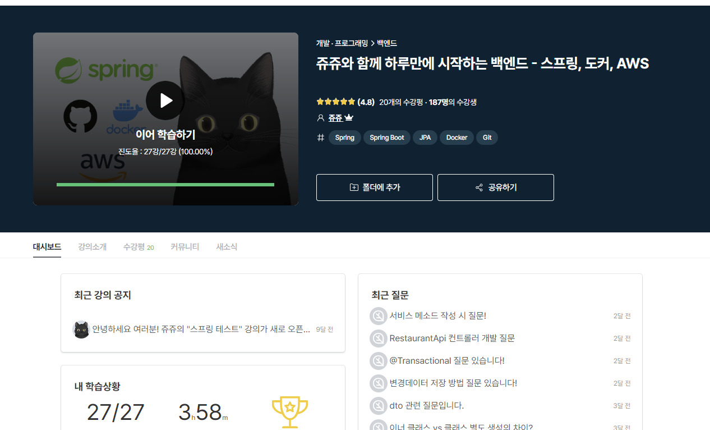

코테이토 들어가고 첫 프로젝트였던 MAIMU 회고록을 써볼까 한다. 아쉬움이 많이 남지만, 그만큼 열심히 했던 프로젝트라 기억에 남아있는 조각들이 많다.

### 시작
>  ~~왜 내께 가장 먼저 찼을까~~

사실 내 착각이 시작이었다. 코테이토 입부 후, 원하는 프로젝트나 스터디 개설에 대해 신청을 받았는데, 1개 이상의 프로젝트나 스터디에 들어가 있어야 한다는 것을 착각해 이때 프로젝트 개설 신청을 해버렸다.~~( 추후에 알고보니 다른 인원이 개설한 곳에 들어가도 되는 거였다. )~~ 학교생활 당시에는 그저 기한만 맞추고 성적만 받기 급급해, React, Django 등 몽골인 처럼 그때그때 필요한 프레임워크를 떠도는 유목민같은 개발자였는데, 뒤늦게 Spring이라는 땅에 정착하기로 마음을 먹고, 사실 막연하게 프로젝트 개설 신청서를 올렸었다. 나도 사실 아는 것이 많이 없고 부족했기에, 주제도 없이 '다 같이 공부하며 성장할 수 있는 프로젝트를 해보자!' 라는 문구 하나만 올렸었던 기억이 있다. 내심 사람이 모이지 않고 폐쇄되기를 바랬지만, 이게 웬걸. 가장 먼저 인원이 가득차버렸다.

### 주제 선정 및 공부..(feat. 우당탕탕)
>  "여러분들 그렇게 우당탕탕 신기하게 개발하고 그러면 신기한 프로젝트 만들고 신기한 곳에서 일하게 되는 거에요"

개발, 프론트, 백엔드, 디자인 네 파트가 모두 모인 프로젝트는 처음이었는데 진짜 사업을 꾸리는 느낌도 나고 재밌었다. 기획 팀의 체계적인 지휘 아래 차곡차곡 프로젝트가 진행되어갔다. 생각보다 오래 걸렸던 건 주제 선정 및 기능 명세였는데, 다양한 사람들이 모이다 보니 각자 생각하는 것이 달랐고, 그 조율점을 찾는데 시간이 많이 소요되었다. 왜 항상 회사의 기획팀과 개발팀이 으르렁 대는지도 어렴풋이 알 것 같았다.(나쁜 뜻은 아닙니다. 수감자 팀 사랑합니다.)

주제 선정이 완료되고, 프로젝트에 Spring을 적용하는 것이 처음이었던 벡엔드 팀은 우선 파트 분배 상관없이 Spring 학습을 시작했다. 같이 성장하는 것이 첫번째 목표였기에, 각자 갓영한의 Spring 강의를 들으며 프로젝트를 위한 경험치를 쌓는데 집중했다.
>  ~~아직도 다 안 들었네ㅋㅋㅋ~~

나름 열심히 공부한다 했지만 급해서 그랬을까. 돌아보니 진짜 우당탕탕 공부해서 우당탕탕 개발했던 것 같다. 완성한게 신기하네. 여러 우당탕탕이 있었는데 하나하나 돌아보는 시간을 가져보도록 하자.

### AWS 우당탕탕 (메일 확인을 잘하자)

내 담당 부분 중 가장 어려웠던 부분이었다. 나는 항상 같은 디렉토리 안에 프론트와 백엔드 소스코드를 모두 담아놓은 채 개발을 진행했었기에, 따로 배포 없이 로컬에서의 기능 구현에 집중해왔었다. '배포도 못하면 어디가서 백엔드 개발자라 하고 다니지 마라' 라는 말을 들었는데, 그래서 당시에 입 다물고 다녀었다. 각종 유튜브와 개블쓰 팀장님(심지어 성도 'GOD')의 도움을 받아 Putty와 FileZilla를 통한 배포 환경을 설정할 수 있었다.

#### 백그라운드 배포

프론트엔드 측이 연결이 된 상태에서 기능 구현을 해야 하는 부분이 많았기 때문에 백그라운드로 ec2를 올려놔야했었다. nohup 명령어를 이용해 서버를 백그라운드에 올려놓았는데 이 경우 위와 같은 Connection timed out 에러가 발생하며 자꾸 서버가 내려가는 문제가 발생했다. 구글링 결과 위치 이동 시 wifi가 변경되면 접속 IP가 변경되기 때문에 발생하는 문제라고 했는데, 집에서만 켜놔도 같은 문제가 발생했다. 에러 발생시에는 '혹시 이거 아닐까' 하면서 다 건드려보는 성격이라 ec2의 swap을 통해서 ram의 부하를 줄여주는 방식도 사용해봤지만 여전히 문제는 해결되지 않았다. (swap을 이용하니 확실히 jar파일 빌드 과정에서의 시간은 빨라졌다.)
결국 putty와 FileZilla와 과감히 안녕하며 AWS 사이트에서 인스턴스 연결을 진행하며, Docker를 이용해 백그라운드로 서버를 돌리는 방식으로 변경하며 문제를 해결할 수 있었다. 근 일주일 동안 백그라운드 문제를 붙들고 있었는데 Docker를 이용하니 바로 문제가 해결되서 조금 김이 샜다.

왜 docker-compose up -d는 잘 되는데 nohup java -jar build/libs/SNAPSHOT.jar & 이거는 왜... 

굉장히 간단하지만 빠르게 Rest API 환경과 배포에 대해서 알아볼 수 있는 좋은 강의! 혹시나 저처럼 감이 안오고 급하시다면 빠르게 개념 잡기 좋은 강의라 추천합니다.

#### 프리 티어 (feat. 요금 폭탄)
이게 더 중요한데 배포에 시달리다가 시간차로 요금 폭탄 공격을 얻어맞았다. 

공격 전에 이런 이메일을 받았는데 금방 보고 지나치며 대수롭지 않게 생각했었다. 여러 강의 및 책에서 과금 가능성에 대해 주의했기에 하라는 대로만 프리티어 설정을 진행했었기에, 나와봤자 얼마 나오겠어라는 식으로 슥 보고 지나쳤었다. 근데 우와. 

프로젝트를 진행하며 EC2, RDS, 탄력적 IP를 여러 개 만들어놨었는데 원인이 여기에 있었다.(망하면 버리고, 다시 만들고...) 기본적으로 인스턴스 1개의 프리티어는 750시간의 무료 기간을 제공해주는데 이 시간이 여러 개의 프리티어를 만들어 놓을 경우 분산되서 시간 단위가 적용된다고 한다.(예를 들어서 ec2가 2개이면 각각 325시간 씩). 폐기한 인스턴스는 바로 바로 삭제를 했어야 했는데 이거를 놔두고 새거를 써서 계속 썼으니 얼씨구나 하고 청구서가 꽉꽉 채워진 것이었다.
위의 사진은 EC2 한정 청구서였는데, RDS나 탄력적 IP 관련 청구서까지 합치면 더 많다는...
안 쓰는 자원은 그때 그때 삭제하는 습관을 가지자.

### Oauth2 우당탕탕(책이 다가 아니다)

서비스의 시작이 로그인이라 생각해서 나는 먼저 로그인 구현에 달려들었다. 사실 다른 것도 잘 모르고, 프론트 측은 뭔가 뚝딱뚝딱 만들어오는데 나도 뭐라도 만들어야겠다 싶어서 가장 먼저 손에 잡힌 로그인을 붙잡았다. 

위의 책을 참고해서 처음으로 Oauth2를 이용한 소셜로그인에 대해 학습하고 따라서 구현을 시도했다. 지금 생각해보면 네이버, 카카오, 구글 들어가서 redirect url 잘 써놓고, rest api 키만 붙여넣으면 됬을건데, 설정도 제대로 못해서 자꾸 에러창만 나오게 했다. 차분하게 했으면 금방했을 텐데, 왜 그렇게 애를 먹었는지 모르겠다.
>  잘 안되가지고 2개나 만들어서 했었다 멍청이!

어찌저찌 설정 및 CustomOauth2Service 까지 만들고 책에서 알려주는대로 index.html을 통해서 소셜로그인을 구현했다. 근데 프론트엔드 측과 연결을 하자니 또 어떻게 하겠는지 모르겠는거다. 항상 같은 디렉토리 안에 프론트와 백엔드 소스를 모두 담아놓고 진행했었기에, 지하철로 30분 거리 넘게 떨어져있는 프론트엔드 측과 연결을 하자니 돌아버리는거였다.

사실 redirect url을 프론트 측의 로그인 버튼 부분에 연결만 하면 되는거였는데, 그 떄는 뺑뺑 돌아서 방법을 찾았었다. 

#### 쿠키 / JWT 토큰

Oauth2를 이용한 소셜로그인은 기본적으로 session 방식이지만 대신 JWT 토큰 방식을 사용하기로 결정했다. 많이들 사용하는 방식이기도 했고, 사용자 정보를 꺼내오고 조회하는데 있어서 토큰 방식이 더 용이해보였기에 내린 결정이었다. 

마이무 서비스는 첫 소셜로그인의 경우 추가 정보를 입력받으며 회워가입을 진행하는 방식을 택했다. 따라서 ROLE_USER와 ROLE_GUEST 사용자를 나누어야 했고, 보여지는 페이지도 달랐어야 했다. 소셜로그인 이후 이메일과 소셜 provider를 조합한 username과 ROLE을 이용해 jwt 토큰을 생성해 로그인 이후에 3000번 포트로 쿠키에 이를 담아서 보내는 방식으로 구현했다.

여기서부터 우당탕탕의 시작인데 순서는 다음과 같다.

> 1. 백엔드 측에선 쿠키를 보내주었지만 프론트 측에서 받지 못한다.
2. session을 stateless로 바꿔놓았으니 사용자를 인증할 정보가 없어, 로그인 화면으로 계속 redirect 된다.
3. 이를 위해서 인증용으로 session의 stateless를 해제하고, 인증 이후에 사용자 정보는 보내준 토큰을 이용해서 가져오도록 구현.
4. cors 설정까지 진행했지만 아직도 token을 못받는다.
5. 알고보니 ec2의 보안 규칙에 3000번 포트를 빼놓았던 것 히히
6. 토큰이 가지만 로그인 화면 넘어간 이후 토큰이 쿠키에서 지워진다. -> 이거 대체 왜??!!!!
7. 일단 진행...
7. Session 때문인 지 사용자의 role 값이 로그인 만하면 추가 정보 입력 없이도 USER로 바로 바뀌어버린다.
8. 그래서 session을 다시 stateless로 바꾸니 2번의 상황이 반복된다.

싸대기 맞고 연병장 2바퀴 돌아야 할 부분이 한 두 군데가 아니지만 여기까지 온 이상 완성을 시켜야한다는 마음이었다. 과감히 쿠키를 버리고 querystring을 통해 토큰을 보내주고 프론트 측에서 토큰을 뽑아와 local storage에 저장해 사용하는 방식으로 노선을 변경했다.

>  갓발자 유미님 감사합니다...
 고뇌의 주석들... 지우는게 맞지만 피땀같아서 못지웠다

다행히 querystring에 담은 토큰은 잘 전달이 되었다. 사실 로그인이 되도 다음 기능들이 잘 안되면 어쩌나 걱정했었는데, 다른 팀원들이 완벽하게 만들어 준 덕에 로그인 문제가 해결되자마자 모든 기능이 정상적으로 동작했다. 

### 이외의 추가적인 우당탕탕
이외에도 많은 우당탕탕이 있는데, 모두 열거하기에는 내일까지 글을 써야할거 같으니 요약하면 다음과 같다.

1. Redis 및 Refresh Token
우선 마이무 서비스의 토큰에는 refresh token이 없다. '아니 그러면 만료 시에는 어떻게 갱신하나요??' access token의 만료 기한이 1시간인데, 이거 끝나면 다시 로그인 하면서 갱신해야한다. 이러면 안되지만, nohup으로 크나크게 고통받은 후라 사실 내팽겨쳤다는게 정설...

솔직히 이거 1시간 이상 안쓸거 같은데 refresh token 뭐 없어도...

2. 인바운드, 아웃바운드 규칙, pem key
Docker로 바꾸며 AWS 사이트에서 인스턴스 연결을 진행했는데 따로 pem key를 발급하지 않았고, 인바운드, 아웃바운드 규칙도 전부 열어놓았다. 일단 연결이 우선이었기에 다른거가 거슬리지 않았으면 좋겠어서...

그만 알아보자

### 수감자들

Spring도 처음이었고, 주제를 미리 정한 것도 아니었기에, 걱정이 앞서는 프로젝트였다. 글에 쓴대로 우당탕탕, 우여곡절이 많았지만, 따로 개발자 톡방도 파며 마무리에 다가갈 수록 열심히 개발했다. 누구 하나 빠지지 않고 열심히 해줘서 그래도 여기까지 올 수 있지 않았나 싶다. 지금은 사실 무산...된 느낌이지만 한달전인가 READ ME가 업로드 된걸보니 언젠가 만나서 꼭 완성하고 싶다. 완성은 못다했지만, 원래 목표였던 성장은 모두가 이뤘던 것 같다. 꼭 이게 아니더라도 너무 마음이 잘맞는 팀원들이었기에, 다른 프로젝트에서도 가능하다면 다시 만나고 싶다. 프로젝트가 아니면 못다한 회식이라도..!

마지막으로 수감자들 사랑합니다. 보고싶어요. 부족한 팀원과 함께 으쌰으쌰 고마웠습니다.

