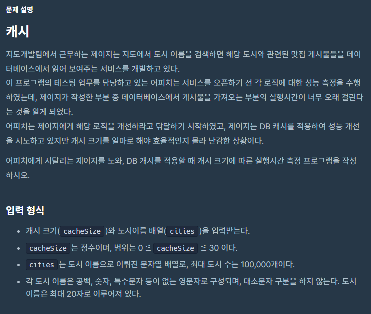
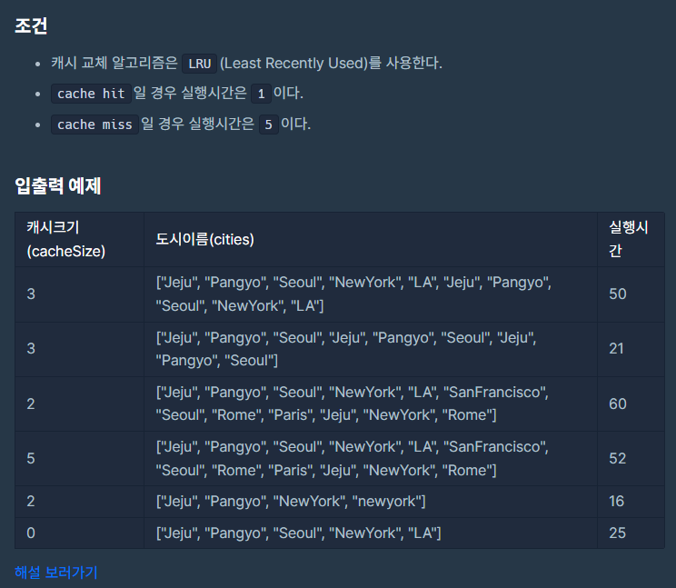
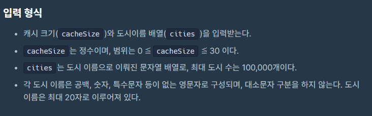

~~해설 보러가기 너무 유혹적이다~~
문제 설명이 이게 끝이므로 LRU 알고리즘에 대해서 미리 알고 있어야 풀 수 있던 문제. 우선 LRU에 대해서 알아보자.

### LRU (Least Recently Used) 알고리즘

Least Recently Used, 말 그대로 가장 오랫동안 쓰이지 않은(참조되지 않은) 페이지를 제거하는 페이지 교체 알고리즘이다. 여기서 _**페이지 교체 알고리즘**_이란 메모리를 관리하는 운영체제에서 새로운 페이지를 할당할 때 현재 할당된 페이지 중 어느 것과 교체할지를 결정하는 알고리즘을 의미한다.

> 페이지 교체 알고리즘의 종류
* FIFO(First In First Out) : 가장 최근에 적재된 페이지를 교체하는 기법
	*단점: 가장 오래된 페이지가 중요도에 상관없이 계속 남아있을 수 있다.
* LFU(Least Frequently Used) : 가장 적게 사용된 페이지를 교체하는 기법
	*단점: 앞으로 참조될 가능성이 많은 페이지가 교체될 수 있다.
* LRU(Least Recently Used) : 가장 오랫동안 사용되지 않은 페이지를 교체하는 기법
	*단점: 페이지가 적재되는 시간을 같이 기록해야 하므로 오버헤드가 발생할 수 있다.
    
추가로 cache hit은 캐시 안에 찾는 페이지가 있을 경우를, cache miss는 캐시 안에 찾는 페이지가 없는 경우를 의미한다.

단순히 Stack, Queue 등의 자료구조로 실제 페이지 교체 알고리즘을 설명하기는 어렵지만, 해당 문제에서는 Queue를 이용해 LRU를 구현할 수 있다.

### 풀이



우선 도시 이름은 영문자로만 구성되며, 대소문자 구분을 하지 않기 때문에 일관적인 값 비교를 위해 모든 도시를 소문자로 바꿔준다. cache의 역할을 할 빈 Queue도 할당한다.
```
Queue<String> cache = new LinkedList<>();
        
        for(int i = 0; i<cities.length; i++){
            cities[i] = cities[i].toLowerCase();
        }
```

이제 배열을 순회하며 cache에 도시 이름을 넣을 건데 cache hit과 cache miss 2가지의 경우를 다음과 같이 나눌 수 있다.

> Cache Hit
1. 해당 데이터를 캐시에서 삭제하고, 캐시(큐)의 뒤쪽에 데이터를 추가한다.

> Cache Miss
1. 캐시에 여유공간이 있는 경우
	1-1. 캐시의 뒤쪽에 데이터를 추가한다.
2. 캐시가 꽉 찬 경우
	2-1. LRU 알고리즘에 따라 캐시의 가장 앞의 페이지를 삭제한 후에, 캐시의 뒤쪽에 데이터를 추가한다.

> 예외!
캐시 사이즈가 0인 경우, 캐시에 페이지를 넣을 수 없다. 따라서 배열의 모든 값에서 cache miss가 발생하므로, 배열의 길이 X 5(cache miss 소요시간)을 return 하고 종료

```
if(cacheSize == 0){
            return cities.length * 5;
        }
        for(int i = 0; i<cities.length; i++){
            if(cache.contains(cities[i])){ // Cache Hit
                // if(cache.size() == cacheSize){
                //     cache.remove(cities[i]);
                // } 쓰고 보니  Cache Hit의 경우 Cache Size를 고려할 필요가 없다;;
                cache.remove(cities[i]);
                cache.offer(cities[i]);
                answer += 1;
            }
            else{ // Cache Miss
                if(cache.size() == cacheSize){
                    cache.poll();
                }
                cache.offer(cities[i]);
                answer += 5;
            }
        }
```

### 전체 코드

```
import java.util.*;

class Solution {
    public int solution(int cacheSize, String[] cities) {
        int answer = 0;
        
        Queue<String> cache = new LinkedList<>();
        
        for(int i = 0; i<cities.length; i++){
            cities[i] = cities[i].toLowerCase();
        }
        if(cacheSize == 0){
            return cities.length * 5;
        }
        for(int i = 0; i<cities.length; i++){
            if(cache.contains(cities[i])){ //hit
                // if(cache.size() == cacheSize){
                //     cache.remove(cities[i]);
                // }
                cache.remove(cities[i]);
                cache.offer(cities[i]);
                answer += 1;
            }
            else{
                if(cache.size() == cacheSize){
                    cache.poll();
                }
                cache.offer(cities[i]);
                answer += 5;
            }
        }
        return answer;
    }
}
```

### Reminder
* Queue.poll() -> 맨 앞에서 데이터 삭제
* Queue.offer() -> 맨 뒤에 데이터 삽입
* Queue.remove(삭제할 원소) -> 삭제할 원소를 찾아 삭제 (맨 앞에서만 뺄 수 있는 줄 알았다;;)
* Queue.contains(원소) -> 해당 원소가 존재하면 true
* (추가) Queue 선언 시 ArrayDeque으로 선언하면 속도가 좀 더 빠르다


#### 한줄 후기
제이지를 해고하고 저를 써주세요.


출처
https://school.programmers.co.kr/learn/courses/30/lessons/17680

https://kwin0825.tistory.com/157

https://hstory0208.tistory.com/entry/%EC%BA%90%EC%8B%9C-%EA%B5%90%EC%B2%B4-%EC%95%8C%EA%B3%A0%EB%A6%AC%EC%A6%98-LRU-LFU