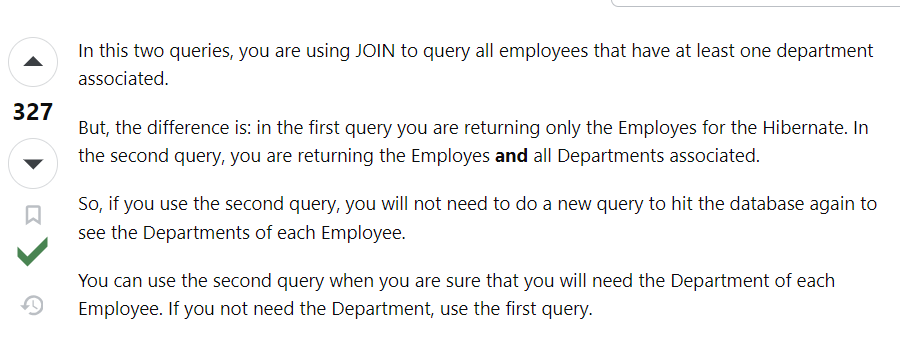

현재 Servlet과 함께 다시 처음부터 스프링을 공부하고 있는데 예전의 나는 정말 우당탕탕 개발했구나라는 것을 뼈저리게 느끼고 있다. 구글이 하라는대로 적었던 filter들이나 listner들의 동작 과정을 공부하니 Spring의 코드가 더 이해가 잘 되는 느낌이다. 물론 실력은 똑같은 거 같은데 느낌이 다르다는... Java나 C++ 등 언어 하나도 깊이 들어갈수록 끝이 없다는데, 작동 원리의 이해가 수반된 개발의 중요성을 크게 느끼는 요즘이다.

오늘은 백엔드 면접에서도 자주 나오는 주제인 N + 1 문제에 대해 알아보자.

## N + 1

N + 1 문제란 테이블 간의 연관 관계에서 발생하는 이슈로 연관 관계를 가지고 있는 엔티티를 조회할 경우 조회된 데이터 갯수 (N) 만큼 연관관계의 조회 쿼리가 추가로 발생하는 문제다. SELECT * FROM A 하나의 쿼리를 날렸을 때 의도하지 않은 이와 연관된 엔티티에 대한 N번의 쿼리가 추가적으로 실행되는 것이다. 정의로 봤을 때 1 + N 으로 부르는 것이 한국어적으로 더 이해가 쉬워보이지만 N + 1로 부르는 것이 통용된다.

JPA를 포함한 ORM은 다양한 연관관계를 제공하는데 이에 따라 다양한 연관관계에서 다양한 N + 1 문제가 발생한다. 이번 글은 @OneToMany, 즉 일대다관계에서 발생하는 N+1 문제에 대해 알아보자.

이런 식으로만 듣게 되면 감이 잘 안오니 조금 풀어서 설명을 해보자.

## FETCH TYPE (Eager Loading, Lazy Loading)

우선 이 Fetch Type에 대해서 알아야한다. Fetch Type이란, JPA가 하나의 Entity를 조회할 때, 연관관계에 있는 객체들을 가져오는 방법이다. JPA는 사용자가 직접 쿼리를 생성하지 않고, JPA가 객체와 필드를 보고 쿼리를 생성하는 JPQL이라는 기술을 사용한다. Spring에서 연관관계는 Entity의 필드내에 @XToX 어노테이션을 이용해 표현하기 때문에 JPQL에게 매핑되어있는 연관관계들을 어떻게 불러올 것인가를 알려주는 것이 Fetch Type이다.

Fetch Type으로는 Eager Loading(즉시 로딩)과 Lazy Loading(지연 로딩)이 존재한다.

### Eager Loading
> 데이터 조회 시에, 연관된 모든 객체의 데이터를 한 번에 불러오는 방법. 이 때 실제로 연관된 객체에까지 직접 접근해 불러온다.

### Lazy Loading
> 데이터 조회 시 연관된 엔티티를 실제로 사용할 때 연관된 엔티티를 조회하는 방법. 실제 객체를 조회하는 것이 아닌 이에 대한 프록시를 맵핑하고 실제 사용될 때 프록시를 통해 이를 조회하는 쿼리가 나간다. 


예를 들어 A 엔티티와 1:N 관계에 있는 B 엔티티가 있다고 생각해보자. 

#### Eager Loading의 경우
> SELECT * FROM A를 실행하며 추가로 SELECT * FROM B WHERE A.id = B.a_id까지 모든 칼럼에 대해 실행하며 실제 A와 맵핑된 모든 B까지 한방에 가져온다.

#### Lazy Loading의 경우
> SELECT * FROM A만 실행하며, 이후 A를 통해 B를 실제로 꺼내 사용해야 할 때 SELECT * FROM B WEHRE A.id = B.a_id 를 실행한다.


현재 UserEntity는 Group과 1 대 N 관계로 매핑되어있다. UserEntity에는 2개, Group에는 이와 연관된 Group이 각각 5개씩, 총 10개의 테스트 데이터가 있다. Fetch Type에 따라 쿼리가 달리 발생하는 것을 볼 수 있다.

테스트 코드는 JPA의 기본 findAll()을 사용하며 가져온 userEntity 객체의 getGroup()을 통해서 group 객체를 불러온다. 해당 작업에서 우리의 의도는 findAll로 userEntity 객체를 가져와 이를 통해 연관된 group을 추가 쿼리 없이 보는 거였지만, 실제로는 user 조회 이외에 N개의 group 조회 칼럼이 실행된다. 이는 group에 접근하는 로직이 발생할 경우 EAGER, LAZY 모두 같은 상황을 발생시킨다.
```
public class UserEntityRepositoryTest {

    @Autowired
    private UserEntityRepository userEntityRepository;

    @Test
    public void testFindAllWithNPlusOneProblem() {
        
        List<UserEntity> users = userEntityRepository.findAll();

        assertThat(users).isNotEmpty();
        System.out.println("---------------------------------");
        for (UserEntity user : users) {
            List<Group> groups = user.getGroups();
            assertThat(groups).isNotNull();
            System.out.println("User: " + user.getUsername() + ", Group count: " + groups.size());
        }
    }
}
```


* SELECT * FROM USER 쿼리를 실행했지만(1) 추가로 각각의 데이터에 대해 group을 찾는 N개(예시에서는 2개)가 더 실행되는 것을 볼 수 있다.

추가로 순수하게 userEntity 데이터만 사용하는 경우에 Lazy Loading은 userEntity의 조회 쿼리만을 실행시키지만 Eager Loading의 경우 이전과 마찬가지로 모든 쿼리를 다 조회하는 것을 확인할 수 있다.

A. Lazy Loading / Group 접근 X


B. Eager Loading / Group 접근 X


Lazy Loading에서 UserEntity 데이터 내 Group 데이터를 사용하지 않을 경우, N+1 문제가 발생하지 않는 것처럼 보이지만, 앞서 말했듯 Lazy Loading은 프록시를 이용해 연관관계들을 매핑하기 때문에 당장 쿼리문이 날아가지 않는 것 뿐, 후에 Group 데이터를 조회할 경우 다시 N개의 쿼리가 발생하기 때문에 근본적인 해결책이 아니다.

따라서 이는 Fetch Type이 아닌 FETCH JOIN과 @EntityGraph를 통해 해결할 수 있다.

## Fetch JOIN, @EntityGraph

Fetch Join은 SQL에서 제공하는 Inner,Outer 같은 Join문과는 다르다. JPQL에서 성능을 최적화하기 위해 제공하는 기능이다. Fetch Join은 성능의 최적화를 위해 Fetch Type이 Lazy이더라도 먼저 실행된다.

예시를 들어보자. (출처 Stack OverFlow)


JPA와 Hibernate을 쓸 때 둘의 차이점을 묻는 질문 중 추천수가 300회 이상인 것에서 가져와봤다. 


첫번째 쿼리의 경우 Hibernate을 위해 오로지 1 : N 관계의 1인 Employee만 반환하지만, 두번째 쿼리의 경우에는 N인 department까지 모두 반환한다고 한다. 조금 더 자세히 설명하자면 Join을 사용할 경우 영속성 컨텍스트에 첫번째 쿼리는 Employee만, 두번째는 모두 올려준다는 답변이다.

그럼 영속성 컨텍스트가 뭔지도 알아야겠네?? ~~(이때부터 주제를 잘못 선택했다는 생각이 들었다.)~~


메인은 나중에 다뤄보고 정말 간단하게 (내가 이해한대로..틀릴 수도 있습니다..)만 이해해보자.


우리는 왜 ORM 기술을 사용할까? 일일이 SQL을 다 쳐가면서 작업을 수행하기에는 서비스의 규모가 너무 방대하다. 이를 개선하기 위해 익숙한 Java, Python 등의 언어로 객체와 findAll()과 같은 Java스러운 코드로 데이터베이스를 주물주물하기 위해 ORM이 이를 중개해주는 것이다.

Spring은 @Entity 어노테이션을 달고 있는 Entity 객체들을 관리하는 EntityManager가 실제 DB 테이블과 매핑하는 중요하는 기능을 수행한다. 이 EntityManager는 Persistence Context, 즉 영속성 컨텍스트라는 논리적 영역을 두며, 이 안에서 Entity를 관리하게 된다. 이 때 Update 처럼 테이블이 바뀌거나 수정되는 작업들은 바로 테이블에 적용하지 않고 이 안에서 모두 가지고 있다가 작업이 commit 되는 순간 실제 테이블에 반영하게 된다. 

결국 정말정말 간단하게 이해해보자면 Entity 별로 관리되는 Spring 환경에서 이 영속성 컨텍스트에 올려야 데이터를 지지고 볶고 할 수 있다는 이야기이다.( 오류가 있다면 알려주세요...ㅠㅠ. )

여기서 Spring이 Entity 단위로 작업을 수행하는 것이 중요한데 첫번째 JOIN 쿼리의 경우 메인이 되는 1의 Entity만을 영속성 컨텍스트에 올린다. 따라서 내부의 연관관계에 해당하는 데이터를 조회하기 위해선 추가로 쿼리를 날려서 다시 올려야한다.

하지만 Fetch Join의 경우 1:N 양쪽 모두를 하나의 쿼리로 올려주기 때문에 추가적인 쿼리, 즉 1+N의 문제를 방지할 수 있다.

오케이. 이제 코드를 수정해보자. Fetch Join은 @Query 어노테이션을 통해 구현할 수 있다.


위와 같이 쿼리문을 작성하며 테스트 편이성을 위해 새로운 findAllWithGroups()를 작성하자.


과연..? 안되면 나 울어


```
@EntityGraph(attributePaths = "groups")
    List<UserEntity> findAllWithGroups();
```

@EntityGraph 어노테이션을 이용해서 Query문을 작성하지 않아도 Fetch Join 형태로 받아올 수도 있다.


## 마무리


@Entity에 @Getter는 곧이 곧 잘 달면서 한번도 연관관계로 매핑된 내부의 객체들은 가져다 쓸 생각을 한번도 안했다.(못했다가 맞을 수도..?) 예시로 사용한 프로젝트에서는 userEntityRepository에서 user_id를 찾고, 이후에 이 찾은 아이디로 다시 groupRepository에서 group을 찾는 방식을 채택했다. 

```
public List<GroupResponse> getList(String username){
        UserEntity userEntity = userRepository.findByUsername(username)
                .orElseThrow(UserEntityNotFound::new);

        return groupRepository.findByUserEntity_IdOrderByIdAsc(userEntity.getId()).stream()
                .map(GroupResponse::new)
                .collect(Collectors.toList());
    }
```

Entity 별로 Repository와 Service를 나누는 것이 직관적이고, 국룰처럼 되었지만, 예시의 서비스처럼 연관관계에서만 이용되는 Entity라면 (생성 로직 제외) Fetch Join을 통해 UserEntity와 함께 구현한다면 좀 더 깔끔하고 간결한 코드가 되지 않았을까 싶다.

그리고 역시 깊이 들어가면 한도 끝도 없는 것이 개발자인걸 다시 한번 깨닫고 간다..


원리를 이해하는 개발자가 되자


### reminder

* N+1 이란? 연관관계가 있는 Entity에서 한 Entity 조회 시 내부 데이터 수 만큼(N) 추가로 쿼리가 실행되는 문제
* Fetch Type: 연관관계의 데이터를 언제 가져올지(Lazy , Eager Loading)
* Spring은 Entity 별로 관리, 이를 영속성 컨텍스트에 올려 지지고 볶는다.
* Fetch Join, @EntityGraph를 통해 N+1 문제 해결 가능

출처
-------------------------------------
https://dwc04112.tistory.com/269

https://frogand.tistory.com/156

https://wonin.tistory.com/490

https://medium.com/sjk5766/jpa-n-1-%EB%AC%B8%EC%A0%9C-%EC%A0%95%EB%A6%AC-d84d50a1b67a

https://stackoverflow.com/questions/17431312/what-is-the-difference-between-join-and-join-fetch-when-using-jpa-and-hibernate

https://devbksheen.tistory.com/entry/JPA-%EC%82%AC%EC%9A%A9-%EC%8B%9C-N1-%EB%AC%B8%EC%A0%9C-%ED%95%B4%EA%B2%B0%ED%95%98%EA%B8%B0

https://youtu.be/ni92wUkAmQI?si=FNTzyjS_v3gfkzad

https://youtu.be/kJexMyaeHDs?si=6j_1AgsiLePZ0uyj