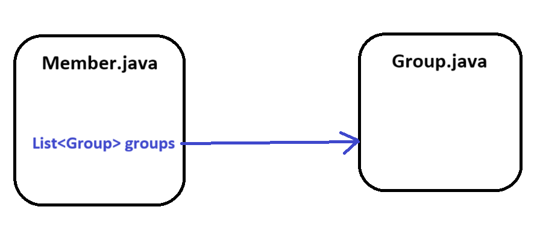
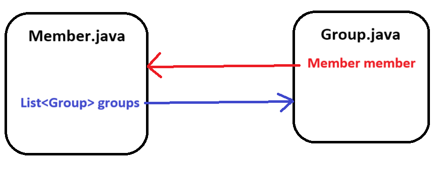
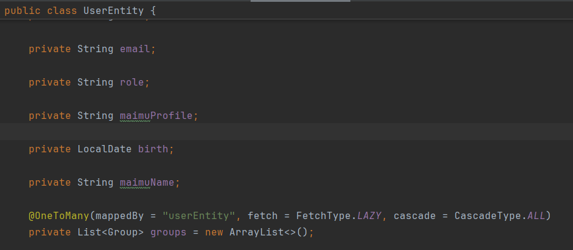
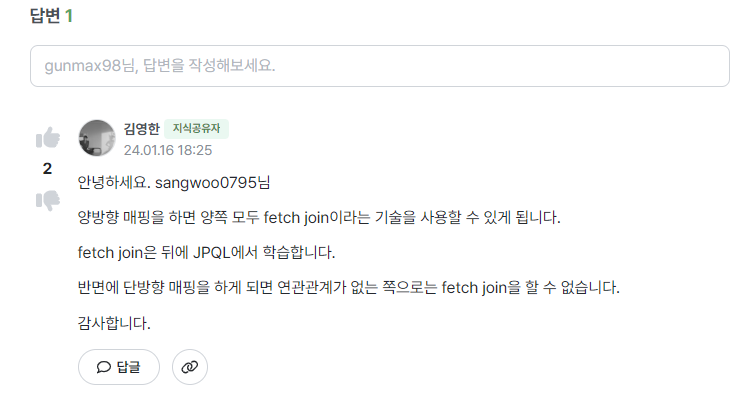
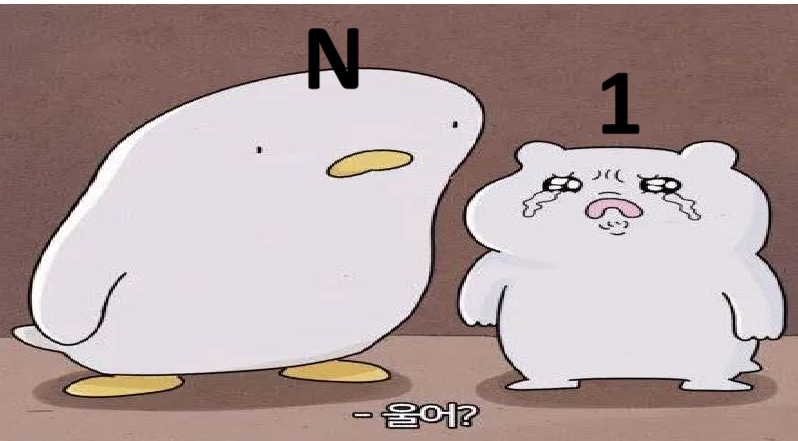
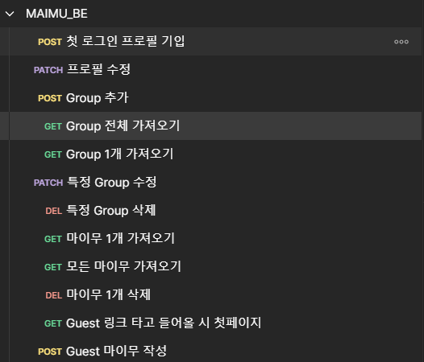

계속 예토전생되는 마이무... GitHub 정리 겸 repository 탐방 중에 READ.ME가 업데이트 되어서 최근 올해 초의 나를 열심히 꾸짖는 중이다. 당시에는 소셜로그인과 토큰, 배포에 심혈을 기울이느라 연관관계들에 대해서는 직관적으로 때려박았었는데, 지금 생각해보면 정신차릴때까지 절벽 끝에 거꾸로 매달아놨어야 했다. 오늘은 일대다의 관계에서 어떻게 연관관계를 설정해야 하는지에 대해 알아보자.


## JPA , Hibernate

JPA에서 가장 중요한 것은 객체와 관계형 데이터베이스 테이블이 어떻게 매핑되는지를 이해하는 것이다. 데이터베이스 테이블은 외래 키를 통해 양 쪽 테이블의 JOIN이 가능하다. 하지만 Java의 객체의 경우, 다른 객체를 참조하는 필드가 있는 객체만이 다른 객체를 참조하는 것이 가능하다. 이를 해겨라기 위해 JPA 및 JPA의 구현체인 Hibernate가 탄생했고, 이러한 불일치를 해결하려는 목적을 가지고 있다.

@OneToMany, @ManyToOne, @ManyToMany 등 여러 어노테이션을 통해 Java를 이용한 백엔드 개발에 편리함을 가져다주었지만, 이는 필승책이 아닌 '도구'라는 것을 명심해야한다. 

## 단방향 / 양방향

> 현재 마이무 데이터베이스에는 Member 테이블과 Group 테이블이 있다. 한 명의 Member는 쪽지를 담을 수 있는 여러 개의 Group을 가질 수 있다. 

앞서 말했듯이, 데이터베이스에서는 ON Member.member_id = Group.member_id로 쉽게 양방향 조인이 가능하지만, Java의 객체의 경우 실제 참조하는 필드가 있어야 다른 객체를 참조할 수 있다.

```
@OneToMany(mappedBy = "userEntity", fetch = FetchType.LAZY, cascade = CascadeType.ALL)
    private List<Group> groups = new ArrayList<>();
    
    //이런 식으로 Member class 내부에 필드가 있어야 getter 등의 방법으로 참조할 수 있는 것.
```

이렇듯 두 객체 사이에서 한 쪽만 참조용 필드를 가지며 참조하면 단방향 관계, 두 객체 모두 각각 참조용 필드를 갖고 참조하면 양방향 관계라고 표현한다.

엄밀히 말하자면 양방향 관계는 2개의 서로를 참조하는 단방향 관계인 것이다.

>단방향의 경우 (Member 만 Group에 대한 참조용 필드를 가지는 경우) 

_Member.getGroups() 로 group 객체 접근 가능 / Group에서 Member는 불가_

> 양방향인 경우 (Member, Group 모두 서로에 대한 참조용 필드를 가지는 경우)

_Member.getGroups() , Group.getMember() 모두 가능_


## 그러면 양방향 매핑이 좋은거 아닌가??

서로 왔다 갔다, 참조의 유연성이 확보될 수 있다고 간단히 생각할 수 있지만 1대다 관계에서 양방향 매핑은 신중하게 써야한다.

### 매핑의 복잡도 증가

Spring에서 연관관계 매핑에 있어 중요한 것은 주인이 누구인가를 설정하는 것이다. 연관관계의 주인을 명시함으로써 두 객체 사이의 실질적인 관계가 어떤 것인지 JPA에게 명확히 알려줘야 한다는 것이다. 쉽게 이해하자면, 주인인 객체는 연관 관계의 두 객체 사이에서 CRUD 모두 가능하지만, 주인이 아닌 객체의 경우에는 조회만 가능하다고 생각하면 된다.

이때 연관 관계의 주인이 아닌 객체에 mappedBy 속성을 사용해서 주인을 명시해준다.

> JPA 양방향 연관관계 주인의 특징!
1. 연관 관계를 갖는 두 객체 중 하나를 연관 관계의 주인으로 지정
2. 연관 관계의 주인만이 외래키를 관리(삽입, 수정, 삭제)
3. 주인이 아닌 쪽은 조회만 가능 -> set~~() 은 주인 쪽에서만 가능
4. 주인은 mappedBy 속성을 사용하지 않음
5. 주인이 아닌 쪽은 mappedBy 속성을 사용하여 주인 지정


> 
groups에 mappedBy 속성을 통해 Group이 주인임을 명시해준다.

단방향 관계일 경우에는 주인에 한해서만 객체 사이의 CRUD 작업을 진행하기 때문에 관리와 수정이 용이하지만 양방향 관계일 경우, 수정에 있어 복잡도가 증가한다.

예시로 위의 UserEntity와 Group이 양방향 관계이며, Group을 다른 UserEntity에 속하도록 수정하려고 할 때, UserEntity의 setGroup()을 사용할 지, Group의 setUser를 사용할 지 혼란이 있을 수 있다.

이는 코드로 잘 구현할 수 있겠지만, JPA에게는 어떠한 외래키를 이용해 CRUD를 진행해야 하는지 혼란을 줄 수 있기 때문에 mappedBy를 통해 반드시 어떤 객체를 사용할 지를 알려줘야 하는 것이다.

위의 코드처럼 작은 규모의 프로젝트에서는 주인관계의 정리가 쉽겠지만, 규모가 커지고 UserEntity에 얽힌 양방향 관계가 기하급수적으로 늘어난다면, 그 복잡도는 끔찍할 것이다.

## 일단 단방향 -> 상황보고 양방향!
> 
뭐해? 올려

지난 N+1 문제에서 해결책으로 제시했던 Fetch Join 관련 양방향 매핑 필요 상황에 대한 갓영한 님의 답변이다. Fetch Join은 연관관계에 있는 한 객체를 가져오며 그 안에 있는 객체까지 한번에 다 가져오고 싶을 때 사용한다. 예시로 사용자의 프로필 정보 검색에 UserEntity의 정보와 사용자가 가진 Group 전체를 같이 보여줘야 하는 기능 등에서 필요할 것이다.

이러한 특수적인 상황 이외에는 주인관계에 있는 객체의 참조로 꺼내오는 단방향 관계로 서비스가 가능할 것이기 때문에 복잡한 양방향을 사전에 박아놓고 시작하기 보다는 단방향으로 구조를 작성한 후에 정말 필요한 상황에서 양방향으로 코드를 수정하라는 것이 갓영한 센세의 의중인 것이다.( 맞겠죠..?)

## 마이무 코드 수정하기

이제 너덜너덜한 마이무 코드를 들여다 보자

UserEntity.java

```
@OneToMany(mappedBy = "userEntity", fetch = FetchType.LAZY, cascade = CascadeType.ALL)
private List<Group> groups = new ArrayList<>();
```

Group.java
```
@ManyToOne(fetch = FetchType.LAZY)
@JoinColumn(name = "userEntity_id", referencedColumnName = "user_id")
private UserEntity userEntity;
```

userEntity_id를 외래키로 가지는 Group이 현재 주인이다.
.

### 외래 키 관리는 누구?? 1?? N??

데이터베이스의 경우, 1대N의 관계에서 항상 N 쪽의 테이블이 외래 키를 가지게 된다. 하지만 Spring 객체의 경우 1과 N 양쪽에서 모두 외래 키의 관리가 가능하다. 참조의 입장에서 말하자면 서로 set() 메소드 등을 통해 서로의 상태 변경이 가능하다는 의미이다.

그러면 단방향 관계의 경우, 누구한테 주인의 역할을 주어야 할까.

결론은 둘 다 기능적으로는 수행이 가능하지만, 데이터베이스가 그렇듯 N 쪽 객체에서 외래 키를 관리하는 주인이 되는 것이 권장된다.



### 1이 주인이 될 경우의 문제점

#### A. 불필요한 UPDATE 쿼리가 1번 더 나간다.


```
@Test
void test1() {
    Group group = new Group("테스트", "테스트");
    Group savedGroup = groupRepository.save(group);

    UserEntity user = new UserEntity("테스트 유저", "테스트 유저");
    user.addGroup(savedGroup);
    UserEntity savedUser = userEntityRepository.save(user);
   
    em.flush();
}
```

UserEntity가 주인일 경우 UserEntity 객체에서 addGroup을 통해 UserEntity 객체에 groups를 갱신하며 데이터베이스에서는 group 테이블의 외래 키의 수정이 진행된다. 

하지만 데이터베이스 테이블에서 외래키는 N 쪽 테이블에 위치한다. N이 주인일 경우에 수정 과정에서 바로 외래 키의 수정이 가능하지만, 외래키를 관리하는 것이 물리적으로 다른 테이블인 1쪽의 객체일 경우 바로 수정이 불가능하며 따로 UPDATE 쿼리를 한번 더 날리는 것으로 외래키를 수정해야 한다.


#### B. 주인 테이블 이외의 쿼리가 발생하게 된다.

위의 A의 이유와 연관되는 문제인데 UPDATE 쿼리 발생 시 주인 테이블이 아닌 곳에서 수정이 발생한다. 이는 작은 규모의 서비스에서는 큰 문제가 되진 않겠지만, 규모가 커질수록 주인 테이블 이외의 쿼리들이 유지 보수에 혼란을 가져다 줄 가능성도 커지게 된다.


### 수정 코드


    public class UserEntity {
    
    @Id
    @GeneratedValue(strategy = GenerationType.IDENTITY)
    @Column(name="user_id")
    private Long id;

    // social login 식별자
    private String username;

    private String name;

    private String email;

    private String role;

    private String maimuProfile;

    private LocalDate birth;

    private String maimuName;

    public void authUser(String role) {
        this.role = "ROLE_USER";
    }

양방향이었던 관계를 끊기 위해 group을 참조하는 코드를 지워준다.


    
```
public class Group {
    @Id
    @GeneratedValue(strategy = GenerationType.IDENTITY)
    @Column(name = "group_id")
    private Long id;

    private String groupName;

    private String groupColor;

    @ManyToOne(fetch = FetchType.LAZY)
    @JoinColumn(name = "userEntity_id")
    private UserEntity userEntity;
```

또한 Group 측에서 외래키를 관리하며 UserEntiy를 참조하기 위해 @ManyToOne, @JoinColumn을 사용해 주인임을 설정해준다.


### 후기


이제와서 보니 사실 양방향 관계를 사용해야 하는 경우는 정말 드물다. 위는 마이무의 API 목록인데, 조회 기능은 토큰으로 전달되는 user_id를 통해서 이루어지고, 수정의 경우에도 각자의 user_id, group_id를 통해 찾은 후 이루어지니, Fetch Join을 이용해 한번에 가져와야 하는 기능은 아직 요구되지 않는다.

간단한 기능들이며 특별히 2개의 테이블의 조인이 요구되는 상황이 없었기 때문에 모두 양방향 관계로 설정해놓았어도 문제가 없었던 것 같다.

하지만 순서 상으로도, 추후 개발의 유지 보수를 위해서 단방향으로 설계를 시작하는 것이 맞는 개발 방법임을 느꼈다.

앞으로의 연관관계 설정은 이제 단방향으로...!

출처

--------------
https://dublin-java.tistory.com/51

https://www.inflearn.com/community/questions/1141491/%EB%8B%A8%EB%B0%A9%ED%96%A5-vs-%EC%96%91%EB%B0%A9%ED%96%A5-%EC%84%B1%EB%8A%A5-%EC%B0%A8%EC%9D%B4

https://velog.io/@conatuseus/%EC%97%B0%EA%B4%80%EA%B4%80%EA%B3%84-%EB%A7%A4%ED%95%91-%EA%B8%B0%EC%B4%88-2-%EC%96%91%EB%B0%A9%ED%96%A5-%EC%97%B0%EA%B4%80%EA%B4%80%EA%B3%84%EC%99%80-%EC%97%B0%EA%B4%80%EA%B4%80%EA%B3%84%EC%9D%98-%EC%A3%BC%EC%9D%B8

https://hstory0208.tistory.com/entry/JPA-%EC%97%B0%EA%B4%80%EA%B4%80%EA%B3%84-%EB%A7%A4%ED%95%91-%EC%A3%BC%EC%9D%B8%EC%97%90-%EB%8C%80%ED%95%B4%EC%84%9C-mappedBy

https://ksh-coding.tistory.com/112

