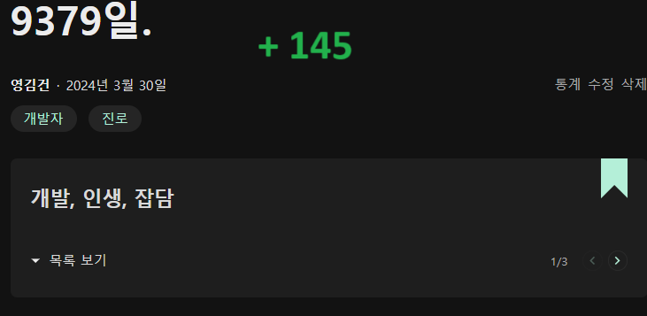
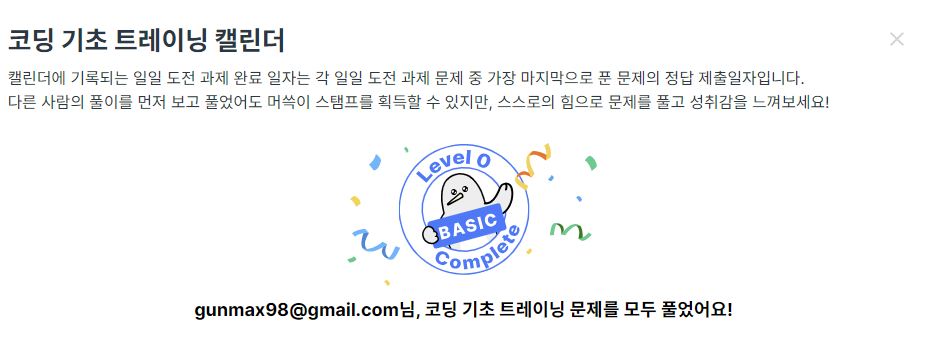
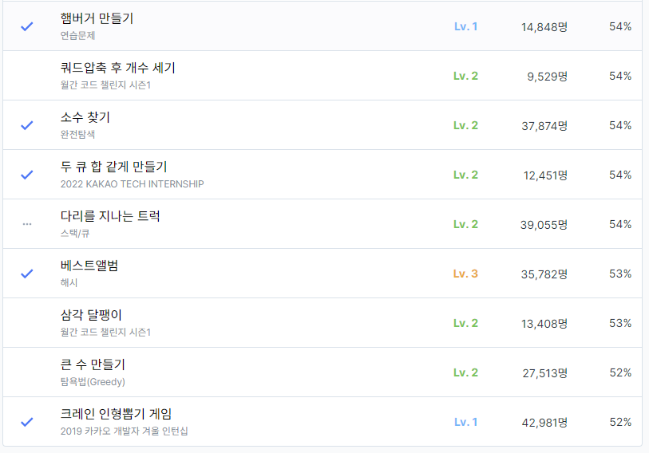
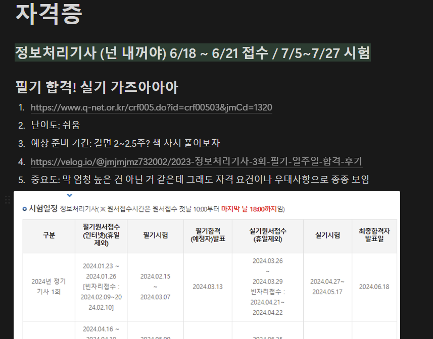
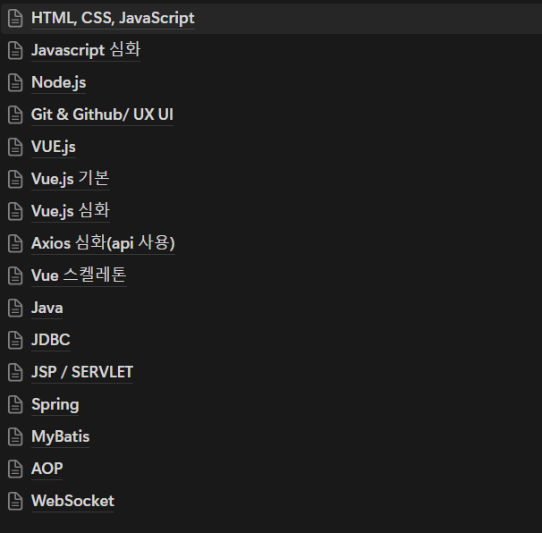
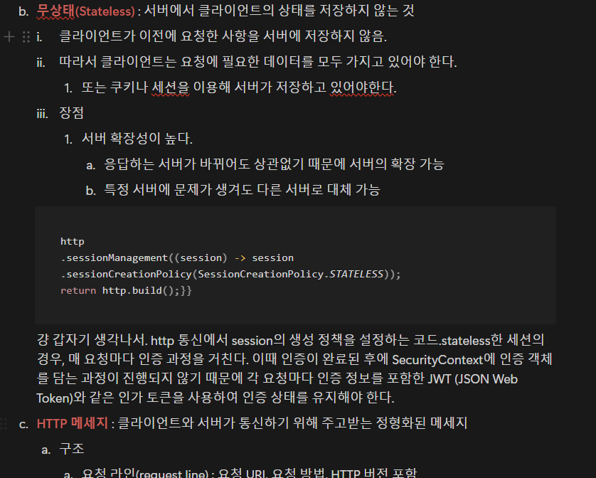
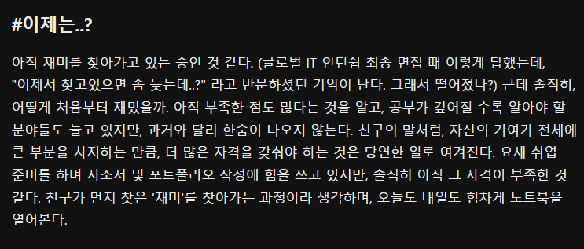

지난번 인생 회고록을 작성한지 벌써 145일이 지났다.

벌써 145일이 지났다고??

과연 145일 동안 영김건은 뭘 했을까?? 살펴보자.

# #코테는 어려워

서류가 아무리 좋고 면접에 자신 있어도 코딩테스트를 뚫지 못하면 말짱 꽝이다. 코딩테스트에 대한 준비를 열심히 하지 않았던 탓에, 상반기 모든 코딩테스트에서 고배를 마셔야했다. 하도 마시다보니 이제 쓴 맛도 안나는 수준이었다.

건방지게 '코테는 기본 실력으로 푸는거지~' 라는 생각을 감히 가지고 있었는데, 드럼통 단위로 고배를 마시고 난 후에야 '아~ 나는 기본 실력이 없구나~'라고 정신을 차릴 수가 있었다.

5월 말쯤인가, 이 즈음부터 무지몽매한 중생에서 벗어나기 위해 초심으로 돌아가 알고리즘 공부를 다시 시작했다.

기업의 코딩테스트가 주로 프로그래머스에서 치뤄졌기 때문에, 프로그래머스의 코딩 기초 문제들을 먼저 전부 풀어보기로 계획했다. 120문제 정도인데 나처럼 전생해서 다시 시작하고 싶은 사람들에게 추천한다. toString(), sort 등 코테에서 활용되는 기초적인 메소드 부터 알고리즘까지 말 그대로 기초를 다지고 갈 수 있는 문제들로 구성되어있었다. 다 푸는데 10일 정도 걸렸던 거 같은데, 기초 문제지만 toNumericValue() 같이 의외로 처음보는 메소드들도 많아 배워가는 부분이 많았다.

기초를 다진 이후에는 10000등 이내를 목표로 하고 문제를 풀어나갔다. 시작은 2만 몇천등이었던 거 같은데 하루에 꼭 5문제씩은 풀자는 마인드로 하다보니 2개월 정도 걸렸던 거 같다. 정답률이 높은 순서대로 차근차근 풀고는 있는데 현재는 55% 즈음에서 막혀서 하루에 1문제 정도밖에 못 풀고 있다. 상위 50퍼가 이리도 어려운 것이었던가

레벨 책정이 조금 거지 같긴 하다. 정답률이 정확한 지표인듯..

근데 프로그래머스 열심히 풀었는데 코테 관련 대화에는 백준 티어 공개 타임이 빠지지 않았다. 주량이 어느정도 되냐는 질문에 '아 나는 소주 못 먹어서..근데 맥주는 7병 마셔' 이러는 느낌이라 백준도 병행을 시작했다. 다수의 기업들이 프로그래머스를 사용하지만 백준의 형태로 보는 오토에버 같은 기업들도 있기에, 둘 모두를 풀어봐야 하는 게 정공법인 것 같다.

실제 개발은 안 그런 경우가 다수 있지만, 코딩 테스트의 경우 정말 푼 만큼 실력이 나오는 게 재밌었다. 코린이 회귀 이후에 치뤘던 코딩 테스트들은 못해도 절반은 솔할 수 있게 되었다. (물론 테스트 케이스만 통과했는지 아직 뚫지는 못했지만..)

개발자 준비생으로서 가장 기피했었던 코딩테스트인데 요새는 잔디도 잘 심어지고, 등수도 올라가는 걸 보니 취준의 가장 재밌는 부분 중 하나가 되었다. 아직 실버 2지만 올해 안에 플레를 찍어보는게 목표...

# #넌 자격(증)이 없어

졸업을 앞두고 교수님과 면담을 진행했었는데, 대학원과 관련된 얘기가 기억에 남는다. 진로에 대한 고민과 함께 주변 지인들은 대학원 선택을 많이 하던데 어떻게 해야할지 모르겠다라는 질문에, 교수님은 요새 대학원에는 '진짜'들이 없다면서 한탄하셨다. 교수님은, 대학원은 '진짜'들이 모여서 그 분야를 파고, 연구를 하는 곳이라고 하셨다. 하지만 요새는, 특히 컴퓨터 공학 쪽에는 취업용 스펙 채우기 용도이거나, 도피성 대학원생들이 많다 느낀다고 덧붙이셨다. 여기까지는 열정적인 교수님의 당연한 답변이지만, 이후에는 현실적인 얘기를 이어가셨다.

> 슬픈 현실이지만, 이렇게 많은 석사들이 나온다는 것은 취업 시장에서 학사들의 경쟁력이 떨어질 수도 있다는 상황이다. 신입한테 많은 것을 바라진 않지만, 동 실력일 경우에는 석사가 더 매력있지 않을까?

대학원은 가지 않았지만 자격증에 한해서 공감되는 말이었다. 스펙의 용도도 있지만, 컴퓨터 공학도의 기본 자질을 가지고 있다는 것을 보여줄 수 있는 말 그대로 '자격'이라는 생각이 들었다. 이번 주의 SQLD 이후에는 AWS Solutions Architect 자격증을 진득하게 준비해볼까 한다. 백엔드 개발자로서 AWS는 빼놓을 수 없는 부분이라 생각하고, 또 멋있잖아 뭔가.

# #개발새발에서 개발개발

개블쓰를 진행하며 가장 쓰기 어려웠던 주제는 개발하면서 들었던 고민이었다. 사실 여태까지 구현에만 몰두하며 코딩은 그저 되는대로 했었다. 구현만 되면 끝이라는 생각에 고민을 한 적이 별로 없어서 더 쓰기 어려웠었다.

하지만 글을 쓰기 위해 예전의 코드들을 뜯어본 결과, 정말 개발새발 개발해왔다는 것을 느꼈다. 패키지들은 여기 저기 흩뿌려져 정리가 안되어있었고, 어노테이션은 덕지덕지, 시간여행이 가능하다면 과거의 나를 화성 보내고 그때 부터 다시 살고 싶을 지경이었다.

현재 다니고 있는 KB IT's your Life에서도 강의를 수강하며, 원리를 인지하는 개발의 중요성을 느끼고 있다. 그저 어노테이션, Response Entity 딸깍딸깍했던 코드들이 깊이 공부할수록 여태껏 축적되어왔던 많은 기술들이 심해에서 겹겹이 쌓여 돌아가고 있다는 것을 깨닫고 있다. Spring은 java 기술의 집합체이며, 동작 원리들을 기초부터 공부하니 어디서 어떤 코드를 작성해야 하는지 알 수 있게 되었다. 구글이 하래서 짜는 코드가 아니라 '아 여기서 이게 필요하니 이걸 써야지'하는 개발 방식으로 넘어가며, 145일 전에는 못 찾았던 재미들을 조금씩 찾아가고 있는 것 같다.

지금은 이 정도...? 아직은 새에서 개가 되어가고 있는 중이다.

# #CS는 꾸준히

컴공생이라면 기본적으로 알아야 할 덕목이라고 생각한다. 학부생 시절에는 이해도 못하고 신토불이 암기력으로만 시험을 봤었던 것 같은데 나이가 차서 그런가. 다시 보니 이해가 훨씬 잘되며 실제 개발에서도 적용되는 부분이 보이기 시작했다. 아직 CS 지식까지 적용할 수준의 개발은 해보지 않았지만, 실무에 뛰어들게 된다면 일을 배우기도 급급한데, CS까지 신경 쓸 시간이 없을 것 같았기에, 미리 미리 준비하기로 결심했다.

실제 개발 과정에서 겹치는 부분들을 생각하며 공부를 하니 머릿속에 더 잘 삽입되는 느낌이다. 

# # 146일

145일전에 작성했던 글의 마지막 부분이다. 4개월 전이지만 같은 결론을 쓰고 싶다. 아직도 부족한 점이 많고, 재미를 찾아가고 있는 중이다. 달라진 게 있다면 과거에는 막연하고 막막했지만, 이제는 구체적인 방법을 찾았다.

많은 시간이 지났지만, 별로 한게 없을까봐, 변한게 없을까봐 이전 글을 보기가 조금 두려웠지만, 그래도 나쁘지 않은 145일을 보낸 것 같다. 타임 머신이 있다면 광배까진 아니더라도 허리는 떳떳하게 피고 나를 만날 수 있을 것 같다.

이제 곧 프로젝트도 시작하고, 써야 할 원서들도 많이 남았지만, 막막하지 않다. 조금 더 일찍 깨달았다면 좋았겠지만, 아직도 못 깨닫는 것보다 다행이지 않은가.

칭찬해 영김건. 145일 이후에 다시 어깨 피고 만나자.

